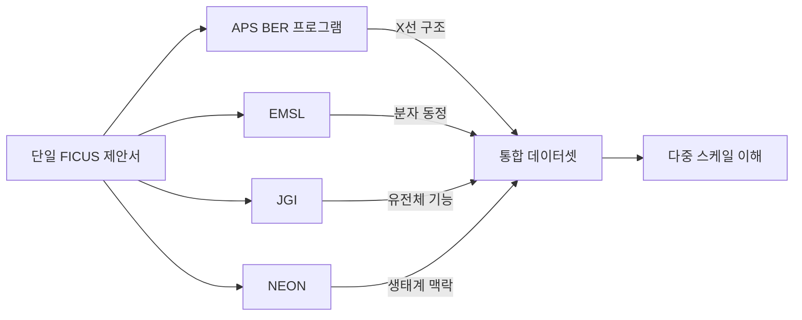

# 파트너 시설

BER 프로그램의 과학적 영향력은 보완적인 DOE 사용자 시설 및 국가 연구 인프라와의 파트너십을 통해
증폭됩니다. 이러한 파트너십은 다중모달 특성화 — 동일한 시스템을 여러 길이 스케일과 분석 기법으로
연구하는 것 — 을 가능하게 합니다.

## 파트너 시설 개요

```
┌─────────────────────────────────────────────────────────────────┐
│                      APS BER 프로그램                             │
│              X선: 구조, 조성, 동역학                               │
└──────────┬──────────┬──────────┬──────────┬──────────┬──────────┘
           │          │          │          │          │
     ┌─────▼──┐  ┌───▼───┐  ┌──▼──┐  ┌───▼───┐  ┌───▼───┐
     │  EMSL  │  │  JGI  │  │NEON │  │ HFIR  │  │ ALCF  │
     │  분자  │  │유전체 │  │생태 │  │중성자 │  │컴퓨팅 │
     │  분석  │  │데이터 │  │데이터│  │ 산란  │  │ HPC  │
     └────────┘  └───────┘  └─────┘  └───────┘  └───────┘
```

---

## EMSL — 환경분자과학연구소

| | |
|---|---|
| **위치** | 태평양북서국립연구소(PNNL), 워싱턴주 리치랜드 |
| **운영** | DOE 생물환경연구국(BER) |
| **웹사이트** | [https://www.emsl.pnnl.gov](https://www.emsl.pnnl.gov) |

### 역량
- **질량분석법**: 분자 특성화를 위한 고해상도 MS (Orbitrap, FT-ICR)
- **NMR 분광학**: 분자 구조를 위한 고체 및 용액 NMR
- **전자현미경**: 극저온 전자현미경, 환경 TEM
- **계산**: 분자동역학, 양자화학

### APS와의 시너지
- APS는 원소 분포(XRF) 제공 → EMSL은 분자 동정(MS) 제공
- 보완적 길이 스케일: APS (nm–µm 구조) + EMSL (분자 수준)
- FICUS를 통한 공동 제안서로 동일 시료에 대한 결합 실험 가능
- **활용 사례**: 토양 유기물 — APS가 원소 분포를 매핑하고 EMSL이 유기종을 동정

---

## JGI — 합동유전체연구소

| | |
|---|---|
| **위치** | 로렌스 버클리 국립연구소(LBNL), 캘리포니아주 버클리 |
| **운영** | DOE 과학국 |
| **웹사이트** | [https://jgi.doe.gov](https://jgi.doe.gov) |

### 역량
- **DNA/RNA 시퀀싱**: 고처리량 전체 유전체, 메타유전체, 메타전사체 시퀀싱
- **유전체 조립 및 주석**: 계산 유전체학 파이프라인
- **기능 유전체학**: 유전자 발현 분석, 경로 재구성
- **합성생물학**: DNA 합성 및 엔지니어링

### APS와의 시너지
- APS는 구조/원소 데이터 제공 → JGI는 유전체/기능 데이터 제공
- **활용 사례**: 근권 미생물군 — APS가 뿌리 주변 양분 원소 분포를 매핑하고
  JGI가 기능적 역할을 확인하기 위해 미생물 군집을 시퀀싱
- FICUS 제안서로 분자 구조와 유전자 기능을 연결하는 "유전형에서 표현형으로" 연구 가능

---

## NEON — 국립생태관측네트워크

| | |
|---|---|
| **위치** | 미국 47개 주 81개 현장에 분산 |
| **운영** | NSF (Battelle 관리) |
| **웹사이트** | [https://www.neonscience.org](https://www.neonscience.org) |

### 역량
- **현장 관측**: 미국 생태계 전반에 걸친 표준화된 생태학적 측정
- **원격 탐사**: 항공 LIDAR, 초분광 이미징, 항공 사진
- **생지화학**: 토양, 수질, 대기화학 모니터링
- **생물다양성**: 생물체 채집, 환경 DNA

### APS와의 시너지
- NEON은 생태계 규모 맥락 제공 → APS는 미시 규모 특성화 제공
- **활용 사례**: 탄소 순환 — NEON이 생태계 CO₂ 플럭스를 측정하고 APS가
  분해를 제어하는 토양 유기물의 나노스케일 구조를 특성화
- 현장 규모 관측과 실험실 규모 메커니즘의 연결 가능

---

## HFIR / CSMB — 고플럭스 동위원소 원자로 / 구조분자생물학 센터

| | |
|---|---|
| **위치** | 오크리지 국립연구소(ORNL), 테네시주 오크리지 |
| **운영** | DOE 과학국 |
| **웹사이트** | [https://neutrons.ornl.gov/hfir](https://neutrons.ornl.gov/hfir) |

### 역량
- **중성자 산란**: SANS, 중성자 회절, 중성자 반사율 측정
- **중성자 이미징**: 중성자 토모그래피, 라디오그래피
- **Bio-SANS**: 생물학적 거대분자를 위한 소각 중성자 산란
- **중수소 표지**: 다성분 시스템을 위한 대비 매칭

### APS와의 시너지
- X선(APS)은 전자 밀도에 민감 → 중성자(HFIR)는 경원소(H, D)에 민감
- **활용 사례**: 단백질-막 상호작용 — APS 결정학으로 단백질 구조 +
  HFIR 중성자 산란으로 지질 이중층 조직 분석
- 보완적 대비 메커니즘으로 완전한 구조 특성화 가능

---

## ALCF — 아르곤 리더십 컴퓨팅 시설

| | |
|---|---|
| **위치** | 아르곤 국립연구소, 일리노이주 레몬트 |
| **운영** | DOE 과학국 |
| **웹사이트** | [https://www.alcf.anl.gov](https://www.alcf.anl.gov) |

### 역량
- **Aurora**: 엑사스케일 슈퍼컴퓨터 (2+ ExaFLOPS)
- **Polaris**: 44페타플롭 GPU 가속 시스템
- **AI/ML 학습**: 대규모 딥러닝 모델 학습
- **데이터 분석**: 대규모 병렬 데이터 처리

### APS와의 시너지
- **핵심 인프라**: APS와 동일한 ANL 캠퍼스에 위치
- 저지연, 고대역폭 연결로 실험 중 실시간 분석 가능
- **활용 사례**: 실시간 토모그래피 재구성 — 빔타임 동안 APS에서 ALCF로 데이터가
  스트리밍되어 GPU 가속 재구성 및 AI 기반 분할 수행
- 대규모 싱크로트론 데이터셋에 대한 AI 모델 학습
- 빔라인 로컬 컴퓨팅으로는 불가능한 대규모 계산 분석 지원

---

## CNM — 나노스케일 물질 센터

| | |
|---|---|
| **위치** | 아르곤 국립연구소, 일리노이주 레몬트 |
| **운영** | DOE 과학국 |
| **웹사이트** | [https://www.anl.gov/cnm](https://www.anl.gov/cnm) |

### 역량
- **나노제조**: 전자빔 리소그래피, 박막 증착
- **주사탐침 현미경**: 극저온 STM, AFM
- **전자현미경**: 수차보정 TEM/STEM
- **이론 및 모델링**: 나노스케일 시뮬레이션

### APS와의 시너지
- CNM은 APS를 위한 특수 시료 환경 및 X선 광학 소자를 제작
- **활용 사례**: 살아있는 세포의 In-situ XRF 측정을 위한 맞춤형 미세유체 장치
- APS 측정을 검증하기 위한 보완적 나노스케일 이미징(전자현미경)

---

## APCF — 아르곤 단백질결정화시설

| | |
|---|---|
| **위치** | 아르곤 국립연구소, 일리노이주 레몬트 |
| **운영** | ANL 생명과학부 |

### 역량
- **결정화 스크리닝**: 자동화된 고처리량 단백질 결정화
- **결정 이미징**: UV 현미경, 자동 결정 검출
- **시료 준비**: 결정 채취, 극저온 냉각
- **우편 서비스**: 원격 결정 스크리닝 및 최적화

### APS와의 시너지
- BER 프로그램 결정학 빔라인(21-ID)에 결정 시료 직접 제공
- 단백질에서 구조까지의 구조생물학 파이프라인 간소화
- 결정 품질 사전 스크리닝으로 빔타임 낭비 감소

---

## FICUS 통합 맵



연구자들은 단일 제안서를 제출하여 여러 시설에 접근할 수 있으며, 이를 통해
단일 시설만으로는 불가능한 진정으로 통합된 다중 스케일 과학을 수행할 수 있습니다.
