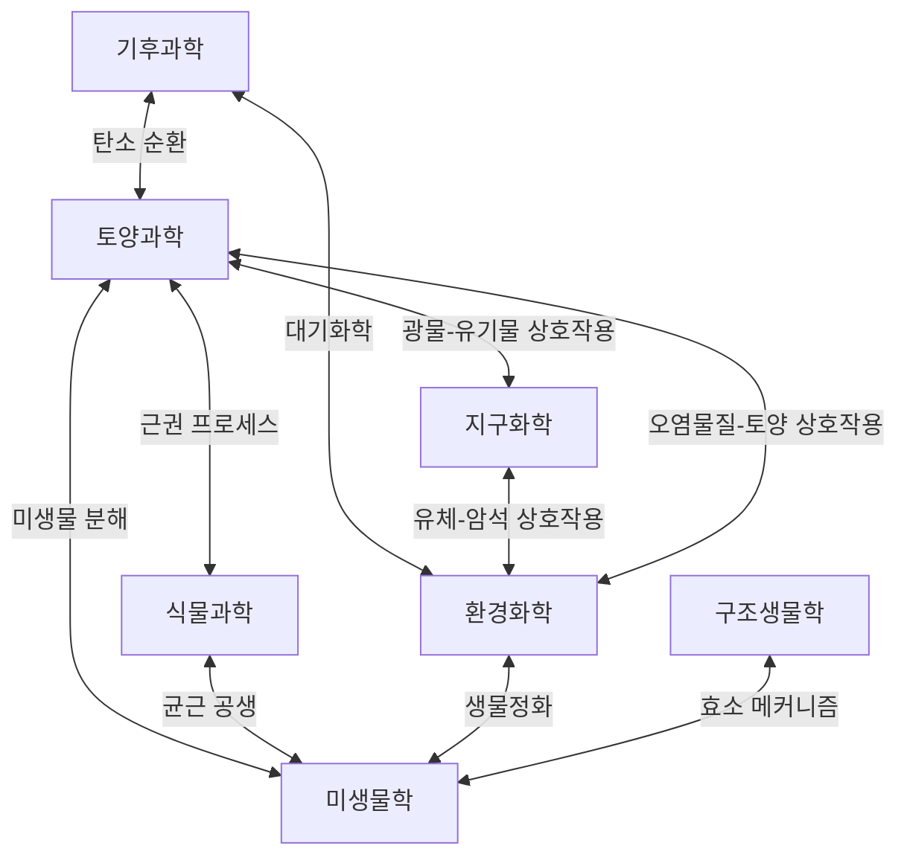

# 연구 분야

BER 프로그램은 생물학 및 환경과학 분야에서 7개의 상호 연결된 연구 분야를 지원합니다.
각 분야는 특정 X선 기법을 활용하며 APS-U 업그레이드의 향상된 역량의 혜택을 받습니다.

---

## 1. 토양과학

### 정의
복잡하고 이질적인 시스템으로서의 토양 연구 — 미시적 스케일에서 토양 유기물(SOM)이
어떻게 형성, 안정화, 분해되는지를 이해합니다.

### 핵심 과학적 질문
- 광물-유기물 결합은 토양의 탄소 저장을 어떻게 제어하는가?
- 토양 응집체 내 유기물의 공간적 분포는 어떠한가?
- 산화환원 변동은 공극 스케일에서 양분 순환에 어떤 영향을 미치는가?
- 수십 년에서 수천 년에 걸친 토양 유기물의 지속성을 무엇이 제어하는가?

### 사용되는 X선 기법
| 기법 | 응용 | 빔라인 |
|------|------|--------|
| µCT / 나노-CT | 3D 공극 구조, 응집체 구조 | 2-BM-A, 32-ID-B/C |
| XRF 현미경 | 원소 매핑 (Fe, Mn, C 연관) | 2-ID-D, 2-ID-E, 8-BM-B |
| XANES/EXAFS | Fe/Mn 산화환원 화학종, S/P 결합 | 9-BM, 20-BM |
| SAXS | SOM 나노구조, 점토광물 조직 | 12-ID-B |

### 대표 연구
- 상관 µCT + XRF를 이용한 토양 응집체 내 광물-유기물 공동 위치화
- µ-XANES를 통한 습지 토양의 산화환원 구동 Fe 화학종 변화
- In-situ 토모그래피로 검증된 공극 스케일 이동 모델링

---

## 2. 식물과학

### 정의
세포에서 기관 수준까지 식물의 구조와 기능을 연구하며, 뿌리 시스템,
양분 흡수 메커니즘, 식물-미생물 상호작용에 중점을 둡니다.

### 핵심 과학적 질문
- 양분이 부족한 환경에서 뿌리 구조는 어떻게 적응하는가?
- 중금속 내성 및 과잉축적의 메커니즘은 무엇인가?
- 균근균은 어떻게 식물 뿌리로의 양분 전달을 촉진하는가?
- 식물 관다발에서 수분 이동을 제어하는 구조적 특성은 무엇인가?

### 사용되는 X선 기법
| 기법 | 응용 | 빔라인 |
|------|------|--------|
| µCT | 토양 내 뿌리 구조, 관다발 3D 이미징 | 2-BM-A, 7-BM-B |
| XRF 나노프로브 | 뿌리 단면의 양분 분포 | 2-ID-D |
| XANES | 식물 조직 내 금속 화학종 | 9-BM, 20-BM |
| 타이코그래피 | 세포벽 나노구조 | 33-ID-C |

### 대표 연구
- 토양 칼럼에서의 뿌리 성장 4D In-situ 토모그래피
- Noccaea caerulescens에서 Zn 과잉축적 메커니즘의 XRF 매핑
- 세포하 양분 매핑을 위한 타이코그래피 + XRF 결합

---

## 3. 환경화학

### 정의
수질, 퇴적물, 폐기물 등 환경 시스템에서 오염물질과 양분의 화학종,
변환, 이동에 대한 연구.

### 핵심 과학적 질문
- 오염 지역에서 중금속의 생물이용성과 독성을 무엇이 제어하는가?
- 인공 나노물질은 환경 매질에서 어떻게 변환되는가?
- 핵폐기물 형태에서 방사성핵종의 화학종과 이동성은 무엇인가?
- 천연 유기물은 광물 표면 및 오염물질과 어떻게 상호작용하는가?

### 사용되는 X선 기법
| 기법 | 응용 | 빔라인 |
|------|------|--------|
| XANES/EXAFS | 금속/준금속 화학종 (As, Cr, U, Pb) | 20-BM, 9-BM |
| XRF 현미경 | 오염물질 공간 분포 | 2-ID-D, 8-BM-B |
| µCT | 다공성 매질 구조, 유동 경로 시각화 | 2-BM-A |
| SAXS/WAXS | 현탁액 내 나노입자 크기/구조 | 12-ID-B |

### 대표 연구
- µ-XANES를 이용한 오염된 지하수 퇴적물의 As(III)/As(V) 화학종 분석
- SAXS로 추적한 폐수처리 과정에서의 나노입자 거동
- 공간분해 EXAFS를 이용한 시멘트 폐기물 형태의 U 화학종 분석

---

## 4. 미생물학

### 정의
X선 방법을 사용한 단일세포 및 군집 스케일에서의 미생물 세포, 군집,
환경과의 상호작용 특성화.

### 핵심 과학적 질문
- 박테리아는 미량 금속을 어떻게 격리하고 활용하는가?
- 개별 미생물 세포의 원소 조성은 무엇인가?
- 바이오필름은 공간적·화학적으로 어떻게 조직되는가?
- X선 방법이 표지 없이 빠른 미생물 표현형 분석을 가능하게 할 수 있는가?

### 사용되는 X선 기법
| 기법 | 응용 | 빔라인 |
|------|------|--------|
| XRF 나노프로브 | 단일세포 원소 분석 | 2-ID-D, 2-ID-E |
| 타이코그래피 | 염색 없는 세포 초미세구조 | 33-ID-C, 2-ID-E |
| MX/SSX | 미생물 효소 구조 | 21-ID-D, 21-ID-G |
| XANES | 바이오필름 내 금속 화학종 | 9-BM |

### 대표 연구
- 박테리아 세포 집단의 XRF 원소 매핑에 ROI-Finder 적용
- 나노미터 해상도에서 비염색 시아노박테리아의 타이코그래피 이미징
- 토양 관련 미생물 효소(니트로게나아제, 라카아제)의 결정 구조

---

## 5. 구조생물학

### 정의
원자 또는 근원자 해상도에서 생물학적 거대분자(단백질, 핵산,
거대분자 복합체)의 3D 구조 결정.

### 핵심 과학적 질문
- 환경 관련 효소(리그닌 분해, 질소 고정)의 구조는 무엇인가?
- 단백질 구조적 변화는 촉매 기능과 어떻게 관련되는가?
- 직렬 결정학이 준생리학적 조건에서 효소 중간체를 포착할 수 있는가?
- 양분 수송에 관여하는 막단백질의 구조는 무엇인가?

### 사용되는 X선 기법
| 기법 | 응용 | 빔라인 |
|------|------|--------|
| MX | 고해상도 단백질 결정학 | 21-ID-D, 21-ID-F |
| SSX | 시간분해 직렬 결정학 | 21-ID-G |
| SAXS | 용액 상태 거대분자 형태 | 12-ID-B |

### 대표 연구
- 토양 미생물 유래 셀룰로오스 분해 효소 복합체의 구조
- 광합성 반응 중심의 시간분해 SSX
- 본질적 무질서 단백질의 용액 내 SAXS 특성화

---

## 6. 기후과학

### 정의
기후변화 이해 및 완화와 관련된 대기 입자, 빙하코어 기록,
물질의 특성화.

### 핵심 과학적 질문
- 대기 에어로졸의 화학 조성과 혼합 상태는 무엇인가?
- 빙하코어 미립자는 과거 기후 조건을 어떻게 기록하는가?
- 탄소 포집 및 저장 물질의 구조적 특성은 무엇인가?
- 구름응결핵은 어떻게 형성되고 진화하는가?

### 사용되는 X선 기법
| 기법 | 응용 | 빔라인 |
|------|------|--------|
| XRF/XANES | 에어로졸 조성 및 화학종 | 2-ID-E, 8-BM-B |
| µCT | 빙하코어 미세구조, 다공성 포집 물질 | 2-BM-A |
| SAXS/WAXS | 에어로졸 나노구조, 얼음 결정학 | 12-ID-B |
| 타이코그래피 | 개별 에어로졸 입자 이미징 | 33-ID-C |

### 대표 연구
- 현장 수집 대기 에어로졸의 단일입자 XRF 분석
- CO₂ 포집용 금속유기골격체(MOF) 물질의 µCT 특성화
- 상관 XRF + XANES를 이용한 빙하코어 미립자 특성화

---

## 7. 지구화학

### 정의
지하 환경에서 행성 물질에 이르는 지질 시스템에서의 광물 변환,
유체-암석 상호작용, 원소 순환 연구.

### 핵심 과학적 질문
- 환경 조건에서 광물은 어떻게 핵생성하고 성장하는가?
- 광물과 유체 상 사이의 원소 분배를 무엇이 제어하는가?
- 미생물 군집은 광물 풍화에 어떤 영향을 미치는가?
- 생체광물화의 메커니즘은 무엇인가?

### 사용되는 X선 기법
| 기법 | 응용 | 빔라인 |
|------|------|--------|
| 회절 (WAXS) | 광물상 동정 | 12-ID-B |
| XANES/EXAFS | 광물 내 원소 배위 | 20-BM, 25-ID |
| µCT | 암석/광물 미세구조 | 2-BM-A, 7-BM-B |
| XRF 현미경 | 광물 내 원소 분대 | 2-ID-D, 8-BM-B |

### 대표 연구
- 제어된 조건에서의 광물 침전에 대한 In-situ WAXS 모니터링
- 철(수산화)산화물 변환의 Fe EXAFS 분광학
- 미생물 풍화된 현무암의 상관 µCT + XRF 매핑

---

## 분야 간 연결

프로그램의 강점은 이러한 분야들을 연결하는 데 있습니다 — 동일한 X선 기법과 빔라인이
여러 연구 커뮤니티를 지원하여 분야 간 발견을 가능하게 합니다.
