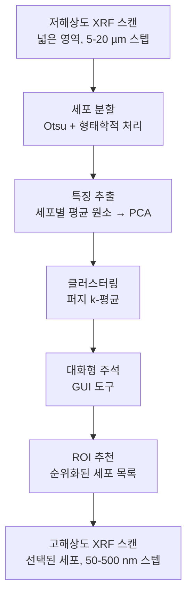

# ROI-Finder: XRF를 위한 ML 기반 ROI 선택

**참고문헌**: Chowdhury et al., J. Synchrotron Rad. 29 (2022)
**DOI**: 10.1107/S1600577522008876
**GitHub**: [https://github.com/arshadzahangirchowdhury/ROI-Finder](https://github.com/arshadzahangirchowdhury/ROI-Finder)

## 개요

ROI-Finder는 X선 형광(X-ray Fluorescence, XRF) 현미경 실험에서 관심 영역(Regions of Interest, ROIs)을 선택하기 위한 ML 기반 도구입니다. 저해상도 서베이 스캔(Survey Scan)을 분석하여 상세한 고해상도 스캐닝을 위한 특정 세포 또는 영역을 추천합니다.

## 동기

XRF 현미경은 해상도와 커버리지 사이의 절충에 직면합니다:
- **저해상도 스캔**: 넓은 영역, 낮은 해상도 (빠름, 완전한 커버리지)
- **고해상도 스캔**: 작은 영역, 높은 해상도 (느림, ROI로 제한)

ROI-Finder는 저해상도 서베이에서 표적화된 상세 스캐닝으로의 전환을 자동화하여, 제한된 빔 타임의 과학적 가치를 극대화합니다.

## 전체 워크플로우



### 1단계: 저해상도 서베이 스캔

- 저해상도(5-20 µm 스텝)로 전체 시료 영역 스캔
- 각 위치에서 전체 XRF 스펙트럼 수집
- MAPS로 처리하여 원소 맵 생성
- 2×2 mm 영역에 대해 일반적으로 10-30분 소요

### 2단계: 세포 분할(Cell Segmentation)

이진 분할 파이프라인 ([image_segmentation/xrf_cell_segmentation.md](../image_segmentation/xrf_cell_segmentation.md) 참조):

```python
# 고대비 채널 선택 (Zn, Fe 또는 P)
# → Otsu 임계값
# → 형태학적 열기/닫기
# → 연결 요소 레이블링
# → 면적 필터링
# 결과: N개의 개별 세포가 있는 레이블된 세포 마스크
```

### 3단계: 특징 추출(Feature Extraction)

각 분할된 세포에 대해 특징 벡터를 계산합니다:

```python
import numpy as np
from sklearn.decomposition import PCA

# 세포별 평균 원소 농도 추출
N_cells = filtered_labels.max()
N_elements = len(elements)
feature_matrix = np.zeros((N_cells, N_elements))

for cell_id in range(1, N_cells + 1):
    mask = filtered_labels == cell_id
    for j, elem in enumerate(elements):
        feature_matrix[cell_id - 1, j] = elemental_maps[elem][mask].mean()

# 표준화 및 PCA 적용
from sklearn.preprocessing import StandardScaler
scaler = StandardScaler()
X_scaled = scaler.fit_transform(feature_matrix)

pca = PCA(n_components=min(5, N_elements))
X_pca = pca.fit_transform(X_scaled)

# 설명된 분산이 유의미한 성분 수를 결정하는 데 도움
print(f"설명된 분산: {pca.explained_variance_ratio_}")
```

### 4단계: 퍼지 K-평균 클러스터링(Fuzzy K-Means Clustering)

```python
import skfuzzy as fuzz

# 퍼지 c-평균 클러스터링
# m=2: 퍼지성 매개변수
cntr, u, u0, d, jm, p, fpc = fuzz.cluster.cmeans(
    X_pca.T,          # 데이터 (특징 × 샘플)
    c=k,              # 클러스터 수
    m=2,              # 퍼지성 계수
    error=0.005,      # 수렴 임계값
    maxiter=1000,     # 최대 반복 횟수
    seed=42
)

# u: 소속 행렬 (k × N_cells)
# u[i, j] = 세포 j가 클러스터 i에 속할 확률
# Σ_i u[i,j] = 1 (각 세포 j에 대해)

# 각 세포를 최고 소속도 클러스터에 할당
cluster_labels = np.argmax(u, axis=0)
```

**왜 퍼지 k-평균인가?**
- 세포가 혼합된 특성을 가질 수 있음 (부분적 소속)
- 소속 값이 신뢰도 측정을 제공
- 이질적 집단에 대해 경성 k-평균보다 더 유용한 정보를 제공

### 5단계: 대화형 주석(Interactive Annotation)

GUI 도구 기능:
- 클러스터 소속에 따라 색상이 지정된 세포 시각화
- 세포 선택/해제
- 클러스터 수 k 조정
- 사용자 정의 레이블로 세포 주석
- 하위 스캐닝을 위한 ROI 선택 저장

### 6단계: ROI 추천

순위 전략:
- **다양성 기반**: 각 클러스터에서 대표를 선택
- **이상치 기반**: 클러스터 중심에서 먼 세포 우선 (비정상적 조성)
- **불확실성 기반**: 퍼지 소속 불확실성이 가장 높은 세포 선택
- **사용자 안내**: 알고리즘적 순위와 도메인 전문가 우선순위를 결합

## 수학적 배경

### PCA 차원 축소

```
주어진: X ∈ ℝ^(N×D) (N개 세포, D개 원소)
표준화: X̃ = (X - μ) / σ

공분산: C = X̃ᵀX̃ / (N-1)
고유 분해: C = VΛVᵀ

주성분: Y = X̃V[:, :k]  (상위 k개 고유벡터에 투영)
```

PCA는 원소 연관성을 식별합니다:
- PC1은 종종 = 전체 신호 강도
- PC2는 Fe-풍부 세포 대 Zn-풍부 세포를 분리할 수 있음
- PC3는 P/S 함량을 구별할 수 있음

### 퍼지 소속 함수(Fuzzy Membership Function)

```
u_ij = 1 / Σ_k (||x_j - c_i||² / ||x_j - c_k||²)^(1/(m-1))

여기서:
  u_ij = 클러스터 i에서 샘플 j의 소속도
  c_i = 클러스터 중심 i
  m = 퍼지성 계수 (m=2 표준)
  ||·|| = 유클리드 거리
```

### 퍼지 분할 계수(Fuzzy Partition Coefficient, FPC)

```
FPC = Σ_i Σ_j u_ij² / N

FPC ∈ (1/c, 1]
FPC = 1 → 완벽하게 분리된 클러스터 (경성 분할)
FPC = 1/c → 완전히 겹침 (구조 없음)
```

FPC를 사용하여 클러스터링 품질을 평가하고 최적의 k를 선택합니다.

## 확장 가능성

### 대안적 클러스터링 방법
- **HDBSCAN**: k를 지정할 필요 없음, 임의 형태의 클러스터 발견
- **DBSCAN**: 밀도 기반, 노이즈 포인트 식별
- **계층적 클러스터링(Hierarchical Clustering)**: 덴드로그램 기반, 다중 스케일 분석
- **스펙트럼 클러스터링(Spectral Clustering)**: 그래프 기반, 비선형 관계 포착

### 딥러닝 특징 추출
- **오토인코더(Autoencoder)**: 원소 프로파일의 압축 표현 학습
- **대조 학습(Contrastive Learning)**: 자기 지도 특징 학습을 위한 SimCLR/MoCo
- PCA를 학습된 비선형 특징으로 대체

### 인스턴스 분할 업그레이드
- **Cellpose**: 접촉/겹침 세포의 더 나은 처리
- **StarDist**: 볼록한 세포 형태에 적합
- **Mask R-CNN**: 바운딩 박스를 포함한 완전한 인스턴스 분할

### 웹 기반 인터페이스
- **Streamlit**: ROI 선택을 위한 대화형 웹 UI (Tkinter 대체)
- 빔 타임 중 원격 접근
- 원격 사용자를 위한 클라우드 배포

### 3D 확장
- XRF 토모그래피 (3D 원소 볼륨)에 적용
- 3D 세포 분할 및 특징 추출
- 볼륨 기반 클러스터링 및 ROI 선택

## 강점

1. **비지도**: 레이블이 지정된 학습 데이터가 필요 없음
2. **실시간 빔 타임 활용**: 실험 중 결정에 충분히 빠름
3. **GUI**: 대화형 시각화 및 주석
4. **해석 가능성**: PCA 로딩이 클러스터링을 주도하는 원소를 보여줌
5. **유연성**: 조정 가능한 매개변수 (k, 원소, 면적 필터)

## 한계

1. **PCA의 선형성**: 비선형 원소 연관성을 포착할 수 없음
2. **이진 분할**: 겹치는/접촉하는 세포에 실패
3. **2D만 지원**: 3D XRF 데이터를 지원하지 않음
4. **특징 공학**: 평균에 대한 PCA는 공간 정보를 버림
5. **k 선택**: 사용자가 클러스터 수를 지정해야 함
6. **GUI 의존성**: 데스크톱 애플리케이션으로, 웹 접근 불가
