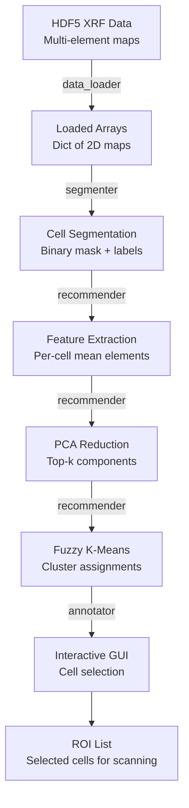

# ROI-Finder: 역공학

## 저장소 구조

```
ROI-Finder/
├── roifinder/                  # Main package
│   ├── __init__.py
│   ├── segmenter.py           # Cell segmentation module
│   ├── annotator.py           # GUI annotation tool
│   ├── recommender.py         # PCA + clustering + recommendation
│   ├── data_loader.py         # HDF5 data loading utilities
│   └── utils.py               # Helper functions
│
├── notebooks/                  # Example Jupyter notebooks
│   ├── demo_segmentation.ipynb
│   ├── demo_clustering.ipynb
│   └── ...
│
├── examples/                   # Example scripts
│   └── run_pipeline.py
│
├── data/                       # Sample data (or links)
│   └── sample_xrf.h5
│
├── tests/                      # Unit tests (if present)
│
├── requirements.txt
├── setup.py
└── README.md
```

*참고: 실제 구조는 다를 수 있습니다 -- 현재 저장소와 대조하여 확인하세요.*

## 데이터 흐름 다이어그램



## 모듈 분석

### 1. data_loader.py

**목적**: MAPS에서 생성된 HDF5 파일로부터 XRF 데이터를 로드합니다.

**주요 함수**:
```python
def load_xrf_data(filepath, elements=None):
    """
    Load elemental maps from MAPS HDF5 file.

    Parameters:
        filepath: str, path to HDF5 file
        elements: list of str, elements to load (None = all)

    Returns:
        dict: {element_name: 2D numpy array}
    """
    with h5py.File(filepath, 'r') as f:
        channel_names = f['/MAPS/XRF_Analyzed/Fitted/Channel_Names'][:]
        maps = f['/MAPS/XRF_Analyzed/Fitted/Counts_Per_Sec'][:]
        # Returns dict mapping element names to 2D arrays
```

**설계 참고 사항**:
- MAPS 특정 HDF5 경로 구조를 읽음
- NNLS 및 ROI 피팅 결과 모두 처리
- 사용자가 지정한 원소로 원소 선택 필터링

### 2. segmenter.py

**목적**: 원소 맵에서 개별 세포를 세그멘테이션합니다.

**알고리즘 흐름**:
```
1. Select reference channel (user-specified or auto-selected)
2. Normalize to uint8 range [0, 255]
3. Gaussian smoothing (optional, sigma parameter)
4. Otsu thresholding → binary mask
5. Morphological opening (remove noise)
6. Morphological closing (fill holes)
7. Connected component labeling
8. Area filtering (remove too-small and too-large objects)
9. Return labeled mask
```

**주요 함수**:
```python
def segment_cells(channel_map, min_area=50, max_area=5000,
                  morph_kernel=5, sigma=1.0):
    """
    Segment cells using thresholding + morphological operations.

    Returns:
        labels: 2D int array (0=background, 1..N=cell IDs)
        properties: list of regionprops objects
    """

def auto_select_channel(elemental_maps):
    """Select channel with highest contrast (coefficient of variation)."""
```

**설계 패턴**:
- 함수형 스타일 (무상태 함수)
- 임계값 처리 및 형태학에 OpenCV 사용
- 연결 성분 및 영역 속성에 scikit-image 사용
- 사용자 조정을 위한 파라미터 노출

### 3. recommender.py

**목적**: 특징을 추출하고, 세포를 클러스터링하고, ROI를 추천합니다.

**알고리즘 흐름**:
```
1. For each segmented cell:
   - Extract mean concentration of each element
   - Optional: extract additional features (std, area, shape)
2. Build feature matrix: (N_cells × N_elements)
3. Standardize features (zero mean, unit variance)
4. PCA dimensionality reduction → top-k components
5. Fuzzy k-means clustering on PCA scores
6. Compute recommendation ranking:
   - Diversity: select from each cluster
   - Outliers: distance from cluster centers
   - Uncertainty: high fuzzy membership entropy
```

**주요 함수**:
```python
def extract_features(elemental_maps, labels, elements):
    """
    Extract per-cell feature vectors from elemental maps.

    Returns:
        feature_matrix: (N_cells, N_elements) array
        cell_ids: list of cell IDs corresponding to rows
    """

def cluster_cells(features, n_clusters=5, n_pca_components=3):
    """
    PCA + fuzzy k-means clustering.

    Returns:
        cluster_labels: (N_cells,) hard assignments
        membership: (N_clusters, N_cells) fuzzy membership matrix
        pca_scores: (N_cells, n_pca_components) projected features
        cluster_centers: (N_clusters, n_pca_components)
    """

def recommend_rois(membership, cluster_labels, n_per_cluster=3):
    """
    Recommend top ROIs based on cluster diversity.

    Returns:
        recommended_ids: list of cell IDs to scan
        scores: recommendation scores
    """
```

**설계 패턴**:
- PCA 및 전처리에 scikit-learn 사용
- 퍼지 c-평균에 scikit-fuzzy 사용
- 추천 전략을 별도의 함수로 분리

### 4. annotator.py

**목적**: 세포를 시각화하고 선택하기 위한 대화형 GUI.

**아키텍처**:
```
Tkinter Main Window
├── Canvas (matplotlib embedded)
│   ├── Elemental map display (selectable channel)
│   ├── Cell boundaries overlay
│   └── Cluster color coding
│
├── Control Panel
│   ├── Channel selector dropdown
│   ├── Cluster number slider
│   ├── Cell info display
│   └── Selection buttons (select/deselect)
│
└── Output Panel
    ├── Selected cell list
    ├── Export button (save ROI list)
    └── Statistics display
```

**주요 설계**:
- Tkinter 기반 데스크톱 GUI
- 과학적 시각화를 위한 Matplotlib 임베디드 캔버스
- 클릭으로 세포 선택하는 인터랙션
- 빔라인 제어 시스템을 위해 선택 항목을 CSV/JSON으로 내보내기

### 5. utils.py

**유틸리티 함수**:
```python
def normalize_map(channel, method='minmax'):
    """Normalize elemental map to [0, 1] range."""

def rgb_composite(maps, r_elem, g_elem, b_elem):
    """Create RGB composite from three elemental channels."""

def save_roi_list(cell_ids, positions, filename):
    """Export ROI positions for beamline scanning."""
```

## 코드 품질 평가

| 측면 | 평가 | 참고 사항 |
|--------|--------|-------|
| **문서화** | ★★★ | README 있음, 독스트링은 다양함 |
| **테스트 범위** | ★★ | 제한된 단위 테스트 |
| **모듈성** | ★★★★ | 명확한 모듈 분리 |
| **코드 스타일** | ★★★ | 전반적으로 깔끔, 약간의 불일치 |
| **오류 처리** | ★★ | 기본적, 더 견고할 수 있음 |
| **의존성** | ★★★★ | 일반적인 과학 Python 스택 |
| **재현성** | ★★★ | 샘플 데이터 및 노트북 제공 |
| **설치** | ★★★ | Conda/pip, 수동 설정이 필요할 수 있음 |

## 주요 설계 결정

1. **Tkinter GUI**: 간단하지만 제한적 -- 데스크톱 전용, 웹 접근 불가
2. **특징을 위한 PCA**: 선형 방법 -- 간단하지만 비선형 패턴 누락
3. **퍼지 k-평균**: 소프트 클러스터링에 좋지만 k 지정 필요
4. **세포별 평균**: 세포 내 공간 정보 버림
5. **이진 세그멘테이션**: 간단하지만 겹치는 세포 처리 불가
6. **MAPS 의존성**: MAPS 형식 HDF5 입력을 가정
