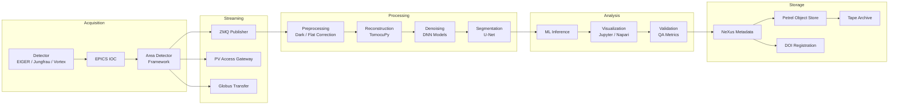

# 데이터 파이프라인 아키텍처 개요

## 소개

APS BER 데이터 파이프라인(data pipeline)은 빔라인(beamline)에서의 광자(photon) 검출부터
장기 아카이브에 저장되는 큐레이션된 데이터셋까지, 방사광 실험 데이터의
전체 생애주기(lifecycle)를 아우릅니다. 파이프라인은 다섯 가지 주요 단계로 설계되어 있습니다:
**수집(Acquisition)**, **스트리밍(Streaming)**, **처리(Processing)**, **분석(Analysis)**, **저장(Storage)**.

각 단계는 잘 정의된 인터페이스를 통해 느슨하게 결합(loosely coupled)되어 있어,
독립적인 확장, 기술 업그레이드, 장애 격리가 가능합니다.

## 파이프라인 단계 한눈에 보기

| 단계 | 주요 시스템 | 일반적인 지연 시간 |
|---|---|---|
| 수집(Acquisition) | EPICS IOC, Area Detector | 실시간 (us-ms) |
| 스트리밍(Streaming) | ZMQ, PV Access, Globus | 1초 미만~수 분 |
| 처리(Processing) | TomocuPy, DNN 파이프라인 | 수 초~수 시간 |
| 분석(Analysis) | ML 추론, Jupyter | 수 분~수 시간 |
| 저장(Storage) | Globus, Petrel, 테이프 | 아카이브(비동기) |

## 전체 흐름 Mermaid 다이어그램

## 설계 원칙

1. **스트리밍 우선(Streaming-first)** -- 데이터는 프레임이 검출기를 떠나자마자 ZMQ와 PV Access를 통해 흐르며, 거의 실시간(near-real-time)에 가까운 피드백 루프를 가능하게 합니다.
2. **GPU 가속 처리** -- 재구성(reconstruction)과 노이즈 제거(denoising) 단계에서 ALCF의 NVIDIA A100 / H100 GPU를 활용하여 검출기 처리량에 맞춰 운영합니다.
3. **메타데이터 기반 출처 추적(provenance)** -- 모든 변환은 NeXus 호환 메타데이터 레코드에 항목을 추가하여 완전한 재현성(reproducibility)을 보장합니다.
4. **연합 저장소(Federated storage)** -- 핫 데이터(hot data)는 즉시 접근을 위해 Petrel에 저장되고, 콜드 데이터(cold data)는 테이프로 마이그레이션되며, Globus가 투명하게 전송을 관리합니다.
5. **장애 내성(Fault tolerance)** -- 각 단계에서 체크포인트를 기록하며, 장애 발생 시 마지막 성공 단계부터 파이프라인을 재개할 수 있습니다.

## 디렉토리 내용

| 파일 | 설명 |
|---|---|
| [acquisition.md](acquisition.md) | 검출기 하드웨어, EPICS IOC, 트리거링 |
| [streaming.md](streaming.md) | 실시간 전송: ZMQ, PV Access, Globus |
| [processing.md](processing.md) | 재구성, 노이즈 제거, 분할(segmentation) |
| [analysis.md](analysis.md) | ML 추론, 시각화, 검증 |
| [storage.md](storage.md) | 아카이브, 메타데이터 표준, DOI 할당 |
| [architecture_diagram.md](architecture_diagram.md) | 종합 Mermaid 시스템 다이어그램 |

## 핵심 기술

- **EPICS** -- 실험 물리학 및 산업 제어 시스템(Experimental Physics and Industrial Control System)
- **TomocuPy** -- GPU 가속 토모그래피 재구성
- **Globus** -- 연구 데이터 관리 및 전송 플랫폼
- **NeXus/HDF5** -- 자기 기술적(self-describing) 과학 데이터 형식
- **Petrel** -- Argonne의 데이터 저장 및 공유 서비스

## 관련 섹션

- `03_beamline_controls/` -- EPICS 구성 및 빔라인 운영
- `05_hpc_computing/` -- ALCF 컴퓨팅 할당 및 작업 스케줄링
- `06_ml_ai/` -- 분석 단계에 공급되는 모델 학습 파이프라인

## 개정 이력

| 날짜 | 작성자 | 변경 사항 |
|---|---|---|
| 2025-06-15 | APS BER Team | 초기 파이프라인 명세 |
| 2025-09-01 | APS BER Team | Globus 스트리밍 경로 추가 |
| 2025-12-10 | APS BER Team | ALCF Aurora를 위한 GPU 전략 업데이트 |
