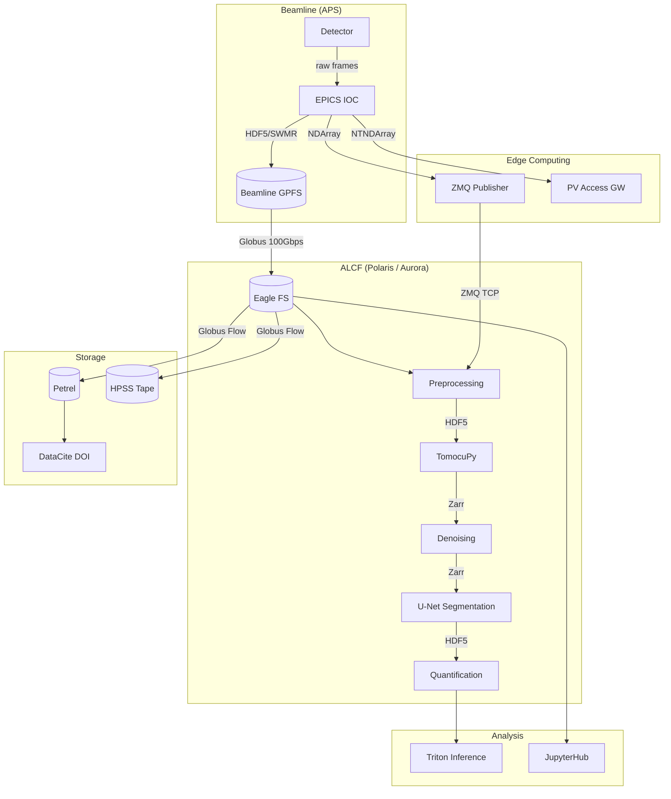
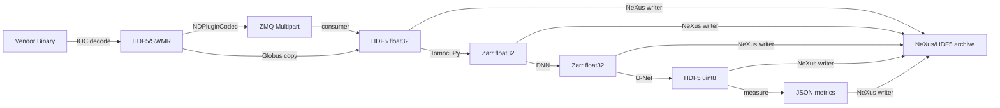
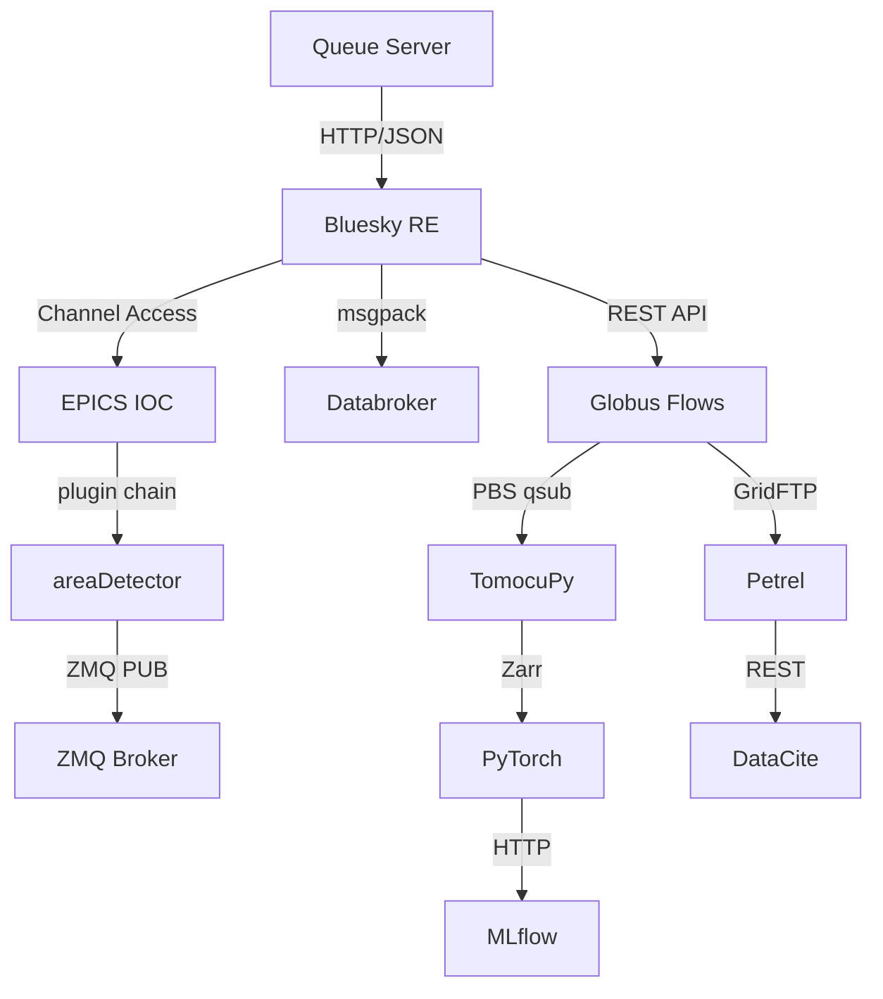
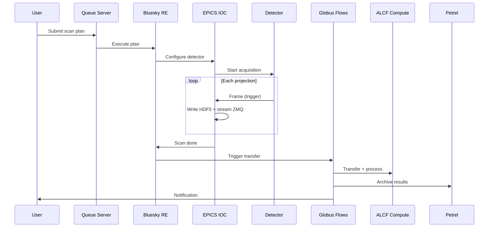
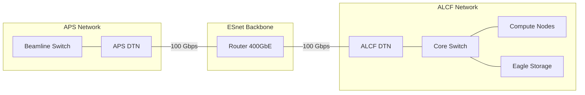

# 시스템 아키텍처 다이어그램

## 개요

APS BER 데이터 파이프라인의 컴포넌트 상호작용, 데이터 형식 변환, 시스템 인터페이스를
보여주는 Mermaid 기반 종합 다이어그램입니다.

## 전체 시스템 아키텍처

## 데이터 형식 변환 지점

## 인터페이스 프로토콜 맵

## 스캔 생애주기 시퀀스

## 네트워크 토폴로지

## 범례

| 기호 | 의미 |
|---|---|
| 직사각형 | 컴퓨팅 서비스 또는 애플리케이션 |
| 원통형 | 저장 시스템 (파일시스템, 데이터베이스, 아카이브) |
| 화살표 라벨 | 인터페이스의 프로토콜 또는 데이터 형식 |
| 서브그래프 | 네트워크 또는 논리적 경계 |

## 관련 문서

- [README.md](README.md) -- 파이프라인 개요
- [acquisition.md](acquisition.md) -- 검출기 및 IOC 상세
- [streaming.md](streaming.md) -- 전송 프로토콜
- [processing.md](processing.md) -- 재구성 및 ML 파이프라인
- [analysis.md](analysis.md) -- 추론 및 시각화
- [storage.md](storage.md) -- 아카이브 및 DOI 워크플로
