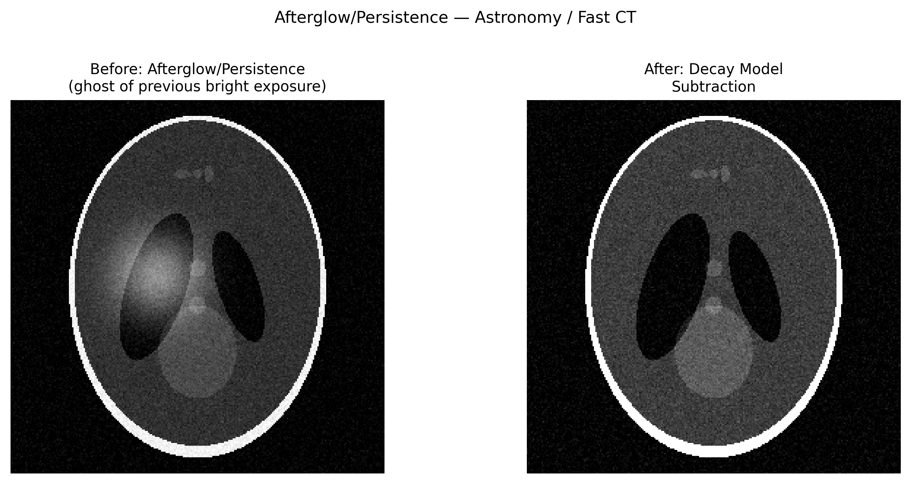

# 검출기 잔광/잔상(Detector Afterglow / Persistence (Lag))

## 분류

| 속성 | 값 |
|------|-----|
| **모달리티** | 교차 도메인 (토모그래피, 회절, 모든 모달리티) |
| **노이즈 유형** | 기기(Instrumental) |
| **심각도** | 주요(Major) |
| **빈도** | 흔함(Common) |
| **탐지 난이도** | 보통(Moderate) |
| **기원 도메인** | 천문학 / 의료 영상 / 방사광 |

## 시각적 예시



> **이미지 출처:** 이전의 밝은 노출이 현재의 어두운 프레임에 잔존하는 고스트(ghost)를 보여주는 합성 이미지. 왼쪽: 잔광 오염. 오른쪽: 감쇠 모델 차감 후. MIT 라이선스.

## 설명

잔광(afterglow, persistence, lag, image retention)은 검출기가 이전 노출의 잔여 신호를 유지하면서 후속 프레임을 오염시키는 현상입니다. 섬광체(scintillator) 기반 검출기에서 잔광은 느린 인광(phosphorescence) 감쇠로 인해 발생하며, 직접 변환 센서(CdTe/CZT)에서는 전하 트랩핑(charge trapping)이 원인입니다. 천문학에서는 밝은 별의 잔상이 이후 수 시간의 노출까지 오염시킬 수 있습니다.

**다중 도메인 관련성:** 천문학(HST WFC3 IR persistence), 의료 영상(평면 패널 CT)에서 광범위하게 연구되었으며, 최근에는 방사광 고속 데이터 수집 실험에서도 점점 중요해지고 있습니다.

## 근본 원인

- **섬광체 잔광:** 형광 물질(CsI, GOS, LYSO)에서 느린 발광 감쇠 (ms ~ 초)
- **전하 트랩핑:** 결함 상태에 갇힌 캐리어가 천천히 방출됨 (CdTe, CdZnTe, Si의 깊은 트랩)
- **적외선 잔상:** 천문학에서 밝은 광원이 트랩을 포화시켜 수 시간에 걸쳐 천천히 방출됨
- 다중 지수 감쇠: 빠른 성분(~ms) + 느린 성분(초 ~ 분)
- 악화 요인: 이전 노출량이 클수록, 특정 섬광체/센서 재료, 저온(트랩 방출이 더 느려짐)

## 빠른 진단

```python
import numpy as np

def measure_afterglow(dark_frames_after_bright, time_stamps):
    """밝은 노출 이후 수집된 다크 프레임으로부터 잔광 감쇠를 측정합니다."""
    mean_signals = [frame.mean() for frame in dark_frames_after_bright]
    # 이중 지수 감쇠 피팅
    from scipy.optimize import curve_fit
    def biexp(t, a1, tau1, a2, tau2, offset):
        return a1 * np.exp(-t/tau1) + a2 * np.exp(-t/tau2) + offset
    t = np.array(time_stamps) - time_stamps[0]
    try:
        popt, _ = curve_fit(biexp, t, mean_signals,
                           p0=[mean_signals[0]*0.9, 0.1, mean_signals[0]*0.1, 1.0, 0],
                           maxfev=5000)
        print(f"Fast decay: τ₁ = {popt[1]:.3f}s (amplitude {popt[0]:.1f})")
        print(f"Slow decay: τ₂ = {popt[3]:.3f}s (amplitude {popt[2]:.1f})")
    except RuntimeError:
        print("Bi-exponential fit failed — try simple exponential")
    return mean_signals
```

## 탐지 방법

### 시각적 지표

- 이전의 밝은 노출의 고스트 이미지가 후속 다크/어두운 프레임에서 보임
- 동적 시퀀스(CT 투영, 시간 분해 회절)에서 체계적인 편향(bias)
- 일정하게 유지되지 않고 연속 프레임에 걸쳐 감쇠하는 강도
- 토모그래피에서: 이전 각도 위치로부터의 "그림자(shadowing)"

### 자동 탐지

```python
import numpy as np

def detect_persistence_in_sequence(frames, expected_uniform=True):
    """잔여 신호의 감쇠를 확인하여 잔상을 탐지합니다."""
    if expected_uniform:
        means = [f.mean() for f in frames]
        # 지수 감쇠 추세 확인
        if len(means) >= 3:
            # 단조 감소 = 잔상
            diffs = np.diff(means)
            if np.all(diffs < 0) and abs(diffs[0]) > 2 * abs(diffs[-1]):
                print("⚠ Persistence detected: decaying residual signal")
                return True
    return False
```

## 보정 방법

### 예방

1. **재료 선택:** 잔광이 적은 섬광체(GGG, LuAG vs CsI) 선택
2. **플러시 프레임(Flush frames):** 밝은 노출 이후 "더미" 프레임을 수집 후 폐기
3. **시간 간격:** 프레임 사이에 충분한 데드타임(dead time) 부여
4. **바이어스 광(Bias light):** 트랩을 채워 잔상을 줄이기 위한 일정한 조명

### 데이터 수집 후

1. **지수 감쇠 차감:** 잔광 감쇠를 모델링하여 후속 프레임에서 차감
2. **재귀적 보정:** 각 프레임을 모든 이전 프레임의 가중 합으로 보정
3. **다크 전류 모니터링:** 잔광을 나타내는 베이스라인 드리프트 추적

```python
def correct_afterglow_recursive(frames, decay_fraction=0.02):
    """간단한 재귀적 잔광 보정."""
    corrected = [frames[0].copy()]
    for i in range(1, len(frames)):
        afterglow = decay_fraction * corrected[i-1]
        corrected.append(frames[i] - afterglow)
    return corrected
```

### 천문학 도구 (전이 가능)

- **HST WFC3 persistence model** — 픽셀별 경험적 잔상 보정
- **AstroPy ccdproc** — 잔상을 고려한 이미지 결합
- **DRAGONS (Gemini)** — 근적외선 파이프라인의 잔상 마스킹

## 핵심 참고문헌

- **Long et al. (2015)** — "Persistence in the WFC3 IR Detector" — 종합적인 HST 모델
- **Malik et al. (2020)** — "Afterglow characterization of scintillator detectors for synchrotron CT"
- **Pani et al. (2004)** — "CsI(Tl) afterglow characterization for medical imaging"
- **Prell et al. (2009)** — "Lag correction for flat panel detectors in CT"

## 방사광 데이터 관련성

| 시나리오 | 관련성 |
|----------|--------|
| 고속 토모그래피 | 짧은 프레임 간격이 잔광 감쇠를 허용하지 않음 |
| 동적 실험 | 시간 분해 데이터가 이전 상태에 의해 오염됨 |
| 스트로보스코픽 이미징 | 밝은 단계의 잔상으로 인해 주기적 신호가 손상됨 |
| CdTe 검출기 (Eiger CdTe) | 고선속에서 전하 트랩핑 → 고스팅 |
| 섬광체 마이크로 CT | 빠른 회전 속도에서 GOS, LYSO 잔광 |

## 관련 자료

- [검출기 일반 문제](detector_common_issues.md) — 일반 검출기 특성 분석
- [플랫필드 문제](../tomography/flatfield_issues.md) — 잔상이 플랫필드 측정을 손상시킴
- [빔 강도 감소](../tomography/beam_intensity_drop.md) — 둘 다 프레임 간 강도 변동을 유발
