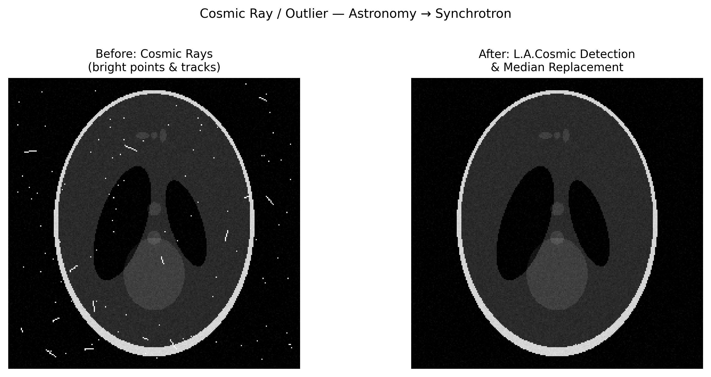

# 우주선/이상치 스파이크 탐지(Cosmic Ray / Outlier Spike Detection)

## 분류

| 속성 | 값 |
|------|-----|
| **모달리티** | 교차 도메인 (모든 이미징 모달리티) |
| **노이즈 유형** | 통계적(Statistical) |
| **심각도** | 주요(Major) |
| **빈도** | 흔함(Common) |
| **탐지 난이도** | 쉬움(Easy) |
| **기원 도메인** | 천문학 / 방사광 / 전자현미경 |

## 시각적 예시



> **이미지 출처:** 우주선(CR) 점과 트랙이 주입된 합성 이미지. 왼쪽: CR 적중에 의한 밝은 픽셀과 짧은 트랙. 오른쪽: L.A.Cosmic 라플라시안 탐지 및 중앙값 대체 후. MIT 라이선스.

## 설명

우주선 이벤트(방사광 분야에서는 zinger, 천문학에서는 hot pixel이라고도 함)는 고에너지 입자가 검출기에 충돌하여 발생하는 고립된, 비정상적으로 밝은 픽셀 또는 작은 클러스터입니다. 천문학에서는 가장 잘 특성화된 노이즈 유형 중 하나이며, 성숙한 탐지 도구(L.A.Cosmic, astroscrappy)가 있습니다. 방사광 카탈로그에서는 토모그래피의 zinger를 이미 다루고 있으며, 이 항목은 천문학 및 전자현미경 분야의 도구와 더 넓은 교차 도메인 관점에 초점을 맞춥니다.

**교차 도메인 가치:** 천문학은 방사광 데이터에 직접 전이 가능한 우주선 제거 알고리즘에 대한 수십 년의 경험을 가지고 있습니다. 라플라시안 에지 탐지 접근법(L.A.Cosmic)은 모든 2D 검출기 데이터에 적용 가능합니다.

## 근본 원인

- 고에너지 입자(우주선, 방사성 붕괴)가 검출기에 에너지를 침착시킴
- 단일 이벤트는 다음을 생성: 밝은 픽셀, 줄무늬/트랙, 또는 클러스터 (에너지와 각도에 따라)
- 발생률: 해수면의 일반적인 실리콘 검출기에서 ~1-5 이벤트/cm²/분
- 고도, 태양 이벤트, 또는 방사성 물질 근처에서 더 높음
- 계수형 검출기(Pilatus/Eiger)에서: 단일 픽셀 > 통계적 기댓값

## 빠른 진단

```python
import numpy as np
from scipy.ndimage import median_filter, laplace

def detect_cosmic_rays_laplacian(image, sigma_clip=5.0):
    """라플라시안을 이용한 L.A.Cosmic 영감 우주선 탐지."""
    # 라플라시안은 날카로운 점 광원을 강조
    lap = laplace(image.astype(float))
    # 국소 노이즈 추정값으로 정규화
    med = median_filter(image, size=5)
    noise = np.sqrt(np.abs(med) + 1)  # Poisson 노이즈 추정
    significance = lap / noise
    # 우주선: 부드러운 배경에 밝은 점 → 큰 음수 라플라시안
    cosmic_mask = significance < -sigma_clip
    n_detected = cosmic_mask.sum()
    print(f"Cosmic ray candidates: {n_detected} pixels ({n_detected/image.size:.4%})")
    return cosmic_mask
```

## 탐지 방법

### 시각적 지표

- 고립된 매우 밝은 픽셀 (이웃보다 훨씬 밝음)
- 때로는 짧은 트랙/줄무늬로 나타남 (비스듬한 입사)
- 동일 위치의 프레임 간에 지속되지 않음
- 날카로운 가장자리 (PSF로 제한된 실제 특징과 다름)

### 자동 탐지 (천문학적 방법)

```python
import numpy as np
from scipy.ndimage import median_filter

def lacosmic_detect(image, gain=1.0, readnoise=5.0, sigclip=5.0, sigfrac=0.3, objlim=5.0):
    """단순화된 L.A.Cosmic 알고리즘 (van Dokkum, 2001)."""
    # Step 1: 서브샘플링과 라플라시안
    # Step 2: 노이즈 모델 구축
    med5 = median_filter(image, size=5)
    noise = np.sqrt(np.abs(med5) / gain + readnoise**2)
    # Step 3: 미세 구조 이미지 (별과 CR 구분)
    med3 = median_filter(image, size=3)
    fine_structure = med3 - median_filter(med3, size=7)
    # Step 4: CR 식별
    residual = image - med5
    cr_candidates = residual > sigclip * noise
    # 실제 구조 제외
    cr_mask = cr_candidates & (fine_structure < objlim * noise)
    return cr_mask

def replace_cosmic_rays(image, cr_mask, method='median'):
    """탐지된 우주선을 국소 중앙값으로 대체합니다."""
    cleaned = image.copy()
    if method == 'median':
        med = median_filter(image, size=5)
        cleaned[cr_mask] = med[cr_mask]
    return cleaned
```

## 다른 도메인의 도구

### 천문학

| 도구 | 설명 | 전이 가능성 |
|------|------|-------------|
| **L.A.Cosmic** (van Dokkum, 2001) | 라플라시안 에지 탐지 | 모든 2D 검출기에 직접 적용 가능 |
| **astroscrappy** | L.A.Cosmic의 최적화된 C 구현 | pip 설치 가능, 빠름 |
| **AstroPy ccdproc** | 완전한 CCD 처리 파이프라인 | 방사광 파이프라인 템플릿 |
| **SExtractor** | 이상치 제거 기반 광원 탐지 | SAXS/분말 회절 스폿 탐지 |

### 전자현미경

| 도구 | 설명 |
|------|------|
| **SerialEM** | 틸트 시리즈 중 실시간 이상치 제거 |
| **IMOD** | 틸트 시리즈에서 X선/핫 픽셀 제거 |
| **RELION** — 이상치 제거 | 마이크로그래프별 핫 픽셀 제거 |

### 방사광 (기존)

| 도구 | 설명 |
|------|------|
| **TomoPy** | 투영에 대한 `remove_outlier()` |
| **Savu** (Diamond) | 이상치 제거 플러그인이 있는 파이프라인 |
| **DAWN** (Diamond) | 대화식 이상치 식별 |

## 핵심 참고문헌

- **van Dokkum (2001)** — "Cosmic-ray rejection by Laplacian edge detection" (L.A.Cosmic) — 기념비적 논문
- **McCully et al. (2018)** — "astroscrappy" — 빠른 L.A.Cosmic 구현
- **Rhoads (2000)** — "Cosmic ray rejection via multiresolution detection" — 웨이블릿 접근법
- **Offermann et al. (2022)** — "Deep learning for cosmic ray removal in astronomical images"

## 벤치마크 및 데이터셋

| 벤치마크 | 도메인 | 설명 |
|----------|--------|------|
| Hubble ACS darks | 천문학 | 잘 특성화된 CR 발생률 및 형태 |
| EMPIAR dark frames | Cryo-EM | 전자 검출기 다크 전류 + 우주선 |
| TomoBank dark scans | 방사광 | zinger가 있는 APS 검출기 다크 |

## 실제 보정 전후 사례

다음 발표된 자료들은 실제 실험적 보정 전후 비교를 제공합니다:

| 출처 | 유형 | 그림 | 설명 | 라이선스 |
|------|------|------|------|----------|
| [Astropy CCD Guide — Section 6.3](https://www.astropy.org/ccd-reduction-and-photometry-guide/v/dev/notebooks/08-03-Cosmic-ray-removal.html) | 튜토리얼 노트북 | 다수 | 실제 CCD 천문 데이터에서의 우주선 제거 보정 전후 | BSD-3 |
| [van Dokkum 2001](https://doi.org/10.1086/323894) | 논문 | Fig 2 | Cosmic-Ray Rejection by Laplacian Edge Detection — 실제 보정 전후 사례를 포함한 기념비적 L.A.Cosmic 논문 | -- |

> **권장 참고자료**: [Astropy CCD Guide — 대화식 보정 전후 사례를 포함한 우주선 제거 노트북](https://www.astropy.org/ccd-reduction-and-photometry-guide/v/dev/notebooks/08-03-Cosmic-ray-removal.html)

## 관련 자료

- [Zinger](../tomography/zinger.md) — 토모그래피의 방사광 특화 우주선 처리
- [죽은/핫 픽셀](../xrf_microscopy/dead_hot_pixel.md) — 일시적 우주선과 비교한 영구적 픽셀 결함
- [검출기 일반 문제](detector_common_issues.md) — 일반 검출기 노이즈 특성 분석
