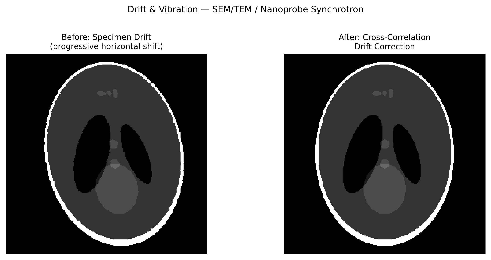

# 시료 드리프트 및 기계적 진동(Specimen Drift & Mechanical Vibration)

## 분류

| 속성 | 값 |
|------|-----|
| **모달리티** | SEM / TEM / 방사광 현미경 |
| **노이즈 유형** | 체계적(Systematic) |
| **심각도** | 주요(Major) |
| **빈도** | 흔함(Common) |
| **탐지 난이도** | 보통(Moderate) |
| **기원 도메인** | 전자현미경 (SEM/TEM) |

## 시각적 예시



> **이미지 출처:** 점진적 수평 드리프트(총 ~20 픽셀)가 적용된 합성 이미지. 왼쪽: 스캔 중 시료 드리프트로 인한 왜곡 이미지. 오른쪽: 라인별 교차 상관(cross-correlation) 정렬 후. MIT 라이선스.

## 설명

시료 드리프트와 기계적 진동은 현미경 이미지에서 공간적 흐림과 왜곡을 유발합니다. 드리프트는 시료의 느리고 연속적인 움직임이며(열 팽창, 피에조 크리프, 기계적 이완), 진동은 빠른 진동성 움직임입니다(건물 진동, 음향 노이즈, 펌프 진동). 둘 다 공간 해상도를 저하시킵니다 — 드리프트는 특징의 방향성 신장을 유발하고, 진동은 등방성 흐림을 유발합니다.

**방사광 관련성:** 위치 정확도가 빔 크기(보통 < 100 nm)보다 좋아야 하는 나노프로브 XRF, 프타이코그래피, 나노 토모그래피에 매우 중요합니다.

## 근본 원인

- **열 드리프트:** 온도 변화가 시료/스테이지의 차등 팽창을 유발 (~nm/s)
- **피에조 크리프:** 압전 스캐너는 재배치 후 로그성 크리프를 보임
- **기계적 진동:** 건물 진동(1-100 Hz), 진공 펌프, 냉각수 라인
- **음향 결합:** 장비나 환경에서 나오는 음파가 시료를 진동시킴
- **정전기력:** 차징이 EM에서 시료 움직임을 유발할 수 있음

## 빠른 진단

```python
import numpy as np

def measure_drift_from_repeated_scans(image1, image2, pixel_size_nm=1.0):
    """교차 상관을 통해 두 순차 스캔 사이의 드리프트를 측정합니다."""
    from scipy.signal import fftconvolve
    # 교차 상관
    corr = fftconvolve(image1, image2[::-1, ::-1], mode='same')
    peak = np.unravel_index(corr.argmax(), corr.shape)
    center = np.array(corr.shape) // 2
    drift_pixels = np.array(peak) - center
    drift_nm = drift_pixels * pixel_size_nm
    print(f"Drift: ({drift_nm[0]:.1f}, {drift_nm[1]:.1f}) nm")
    print(f"Drift rate: {np.linalg.norm(drift_nm):.1f} nm/frame")
    return drift_nm
```

## 탐지 방법

### 시각적 지표

- **드리프트:** 한 방향으로 신장된 특징; 느린 스캔이 빠른 스캔보다 더 많은 왜곡을 보임
- **진동:** 등방성 흐림; 고주파 디테일 손실; "흔들리는" 가장자리
- 순차적 프레임이 체계적 시프트를 보임
- FFT가 비등방성 고주파 롤오프(드리프트) 또는 등방성 롤오프(진동)를 보임

### 자동 탐지

```python
import numpy as np

def drift_from_fft_anisotropy(image):
    """FFT 비등방성으로부터 드리프트 방향을 탐지합니다."""
    F = np.abs(np.fft.fftshift(np.fft.fft2(image)))
    ny, nx = F.shape
    cy, cx = ny // 2, nx // 2
    # 방사형 섹터에서 파워 계산
    Y, X = np.ogrid[-cy:ny-cy, -cx:nx-cx]
    angles = np.arctan2(Y, X)
    radii = np.sqrt(X**2 + Y**2)
    high_freq = (radii > min(cy, cx) * 0.3) & (radii < min(cy, cx) * 0.8)
    # 각도별 파워 분포
    n_sectors = 36
    sector_power = []
    for i in range(n_sectors):
        a0 = -np.pi + 2 * np.pi * i / n_sectors
        a1 = a0 + 2 * np.pi / n_sectors
        mask = high_freq & (angles >= a0) & (angles < a1)
        sector_power.append(F[mask].mean() if mask.any() else 0)
    anisotropy = np.max(sector_power) / (np.mean(sector_power) + 1e-10)
    drift_direction = np.argmax(sector_power) * 360 / n_sectors - 180
    return anisotropy, drift_direction
```

## 보정 방법

### 전통적 접근법

1. **교차 상관 정렬:** 순차 프레임/스캔라인을 정렬하여 드리프트 보정
2. **MotionCor2 / RELION:** Cryo-EM을 위한 무비 프레임 정렬
3. **스캔 라인 정합:** SEM에서 각 스캔 라인을 독립적으로 보정
4. **진동 격리:** 수동(에어 테이블) 또는 능동(피드백 제어) 격리
5. **온도 안정화:** 현미경 주위의 열 격납

```python
def correct_scanline_drift(image, reference_line=0):
    """라인별 교차 상관으로 SEM 이미지의 수평 드리프트를 보정합니다."""
    corrected = image.copy()
    ref = image[reference_line, :]
    for i in range(image.shape[0]):
        corr = np.correlate(ref, image[i, :], mode='full')
        shift = corr.argmax() - len(ref) + 1
        corrected[i, :] = np.roll(image[i, :], -shift)
    return corrected
```

### AI/ML 접근법

- **MotionCor2:** GPU 가속 프레임 정렬 (Zheng et al., 2017)
- **딥 드리프트 보정:** 이미지 특징으로부터 드리프트 궤적을 예측하는 CNN
- **신경 암묵적 표현:** 스캔 중 연속적 드리프트 모델링

## 핵심 참고문헌

- **Zheng et al. (2017)** — "MotionCor2: anisotropic correction of beam-induced motion for improved cryo-EM"
- **Jones et al. (2015)** — "Smart Align: drift correction for scanning probe microscopy"
- **Ophus et al. (2016)** — "Correcting nonlinear drift distortion of scanning probe and scanning transmission electron microscopies"

## 방사광 데이터 관련성

| 시나리오 | 관련성 |
|----------|--------|
| 나노프로브 XRF/XAS | 래스터 스캔 중 시료 드리프트가 원소 맵을 왜곡 |
| Ptychography | 드리프트로 인한 위치 오차 (position_error.md 참조) |
| 나노 토모그래피 | 투영 사이의 드리프트가 정합 오류를 유발 |
| In-situ 실험 | 반응 중 열적/기계적 변화로 인한 드리프트 |
| 장시간 EXAFS 스캔 | 모노크로미터 드리프트(에너지 보정 드리프트) |

## 실제 보정 전후 사례

다음 발표된 자료들은 실제 실험적 보정 전후 비교를 제공합니다:

| 출처 | 유형 | 그림 | 설명 | 라이선스 |
|------|------|------|------|----------|
| [Zheng et al. 2017 — MotionCor2](https://doi.org/10.1038/nmeth.4193) | 논문 | Fig 1 | Cryo-EM 무비 프레임의 드리프트 보정 전후 — 비등방성 빔 유도 모션 보정 | -- |

> **권장 참고자료**: [Zheng et al. 2017 — MotionCor2 (Nature Methods)](https://doi.org/10.1038/nmeth.4193)

## 관련 자료

- [위치 오차](../ptychography/position_error.md) — 드리프트가 프타이코그래피에서 위치 오차를 유발
- [모션 아티팩트](../tomography/motion_artifact.md) — 토모그래피의 유사한 모션 효과
- [에너지 보정 드리프트](../spectroscopy/energy_calibration_drift.md) — 에너지 영역의 드리프트
