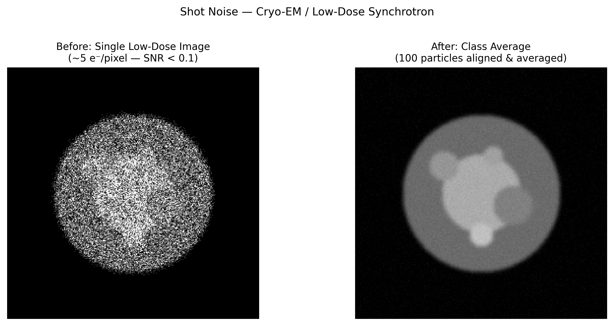

# 저선량 이미징에서의 산탄 노이즈(Shot Noise in Low-Dose Imaging)

## 분류

| 속성 | 값 |
|------|-----|
| **모달리티** | SEM / TEM / Cryo-EM |
| **노이즈 유형** | 통계적(Statistical) |
| **심각도** | 심각(Critical) |
| **빈도** | 항상(Always) |
| **탐지 난이도** | 쉬움(Easy) |
| **기원 도메인** | 전자 현미경(Electron Microscopy) |

## 시각적 예시



> **이미지 출처:** ~5 e⁻/pixel 수준의 푸아송 노이즈를 가한 합성 입자 이미지. 왼쪽: 단일 저선량 노출(SNR < 0.1). 오른쪽: 정렬된 100개 입자의 클래스 평균. MIT 라이선스.

## 설명

산탄 노이즈(Shot noise, 푸아송 노이즈)는 전자 검출의 이산적 특성에서 비롯되는 전자 현미경의 근본적인 통계 노이즈입니다. 각 픽셀의 전자 수는 푸아송 분포를 따르며, 분산은 평균 카운트와 같습니다. 방사선에 민감한 cryo-EM 생체 시료에 필수적인 저선량 이미징에서는 SNR이 매우 낮아질 수 있어(입자 이미지당 SNR < 0.1), 평균화 없이는 개별 입자를 사실상 볼 수 없습니다.

**방사광 관련성:** 저플럭스 방사광 측정(XRF, 저선량 CT)에서의 광자 계수 노이즈와 직접적으로 유사합니다. 푸아송 노이즈 모델, SNR 고려사항, 평균화 전략은 동일합니다.

## 근본 원인

- 전자 검출은 이산적 카운팅 과정 → 푸아송 통계
- 다음의 경우 저선량이 요구됨: 생물학적 cryo-EM, 빔 민감성 물질, in-situ 실험
- 픽셀당 검출 전자 수가 N일 때 SNR = √N
- 일반적인 cryo-EM: 총 선량 ~20-40 e⁻/Ų → 입자 이미지당 SNR < 0.1
- 검출기 DQE(Detective Quantum Efficiency) < 1로 인해 더욱 악화

## 빠른 진단

```python
import numpy as np

def assess_poisson_noise(image, gain=1.0):
    """Verify Poisson noise characteristics via mean-variance analysis."""
    # Divide image into blocks
    block_size = 32
    means, variances = [], []
    ny, nx = image.shape
    for y in range(0, ny - block_size, block_size):
        for x in range(0, nx - block_size, block_size):
            block = image[y:y+block_size, x:x+block_size] / gain
            means.append(block.mean())
            variances.append(block.var())
    means, variances = np.array(means), np.array(variances)
    # For Poisson noise: variance ∝ mean (slope ≈ 1/gain)
    from numpy.polynomial.polynomial import polyfit
    slope = polyfit(means, variances, 1)[1]
    print(f"Variance/Mean slope: {slope:.3f} (expect ~{1/gain:.3f} for Poisson)")
    return slope
```

## 탐지 방법

### 시각적 지표

- 이미지 전체에 걸쳐 균일하게 나타나는 거칠고 "얼룩진(speckled)" 외관
- 선량이 낮을수록 SNR이 저하 — 특징을 노이즈와 구분하기 어려움
- cryo-EM에서 개별 입자 이미지가 노이즈 덩어리(blob)처럼 보임
- 노이즈 진폭이 √(신호 강도)에 비례

### 자동 탐지

```python
import numpy as np

def estimate_snr_per_particle(micrograph, particle_coords, box_size=256):
    """Estimate SNR of individual particles in cryo-EM micrograph."""
    snrs = []
    for y, x in particle_coords:
        particle = micrograph[y-box_size//2:y+box_size//2,
                             x-box_size//2:x+box_size//2]
        if particle.shape == (box_size, box_size):
            # Spectral SNR estimation
            F = np.fft.fft2(particle)
            power = np.abs(F)**2
            # Signal: low frequency, Noise: high frequency
            signal_power = power[:box_size//8, :box_size//8].mean()
            noise_power = power[box_size//4:, box_size//4:].mean()
            snrs.append(np.sqrt(signal_power / noise_power))
    print(f"Mean particle SNR: {np.mean(snrs):.3f}")
    return snrs
```

## 보정 방법

### 전통적 접근

1. **클래스 평균화(Class averaging):** 수천 개의 유사 입자 이미지를 정렬하고 평균(cryo-EM의 표준 방법)
2. **선량 가중치(Dose weighting):** 영화 프레임을 방사선 손상 인식 필터로 가중(높은 선량 = 더 큰 손상 = 고주파에서 낮은 가중치)
3. **위너 필터링(Wiener filtering):** 알려진 CTF와 노이즈 모델이 주어졌을 때 최적의 선형 필터
4. **전자 카운팅(Electron counting):** 카운팅 모드의 직접 검출(DQE → 1)

```python
def dose_weighting(movie_frames, dose_per_frame, voltage=300):
    """Apply dose-dependent frequency weighting to movie frames."""
    n_frames, ny, nx = movie_frames.shape
    freqs = np.fft.fftfreq(ny).reshape(-1, 1)**2 + np.fft.fftfreq(nx).reshape(1, -1)**2
    freqs = np.sqrt(freqs)
    weighted_sum = np.zeros((ny, nx), dtype=complex)
    weight_sum = np.zeros((ny, nx))
    for i, frame in enumerate(movie_frames):
        cumulative_dose = (i + 0.5) * dose_per_frame
        # Optimal exposure filter (Grant & Grigorieff, 2015)
        critical_dose = 0.245 * (freqs * ny + 1e-10)**(-1.665) + 2.81
        weight = np.exp(-cumulative_dose / (2 * critical_dose))
        F_frame = np.fft.fft2(frame)
        weighted_sum += F_frame * weight
        weight_sum += weight
    return np.real(np.fft.ifft2(weighted_sum / (weight_sum + 1e-10)))
```

### AI/ML 접근

- **Topaz-Denoise:** cryo-EM을 위한 자기지도 디노이징 (Bepler et al., 2020)
- **CryoDRGN:** 이질적 재구성을 위한 심층 생성 모델
- **Noise2Noise / Noise2Void:** EM 데이터에 적용 가능한 자기지도 접근법
- **Warp:** ML 기반 디노이징을 활용한 실시간 처리

## 주요 참고문헌

- **Bepler et al. (2020)** — "Topaz-Denoise: general deep denoising models for cryoEM" — Nature Communications
- **Grant & Grigorieff (2015)** — "Measuring the optimal exposure for single particle cryo-EM" — dose weighting
- **Zheng et al. (2017)** — "MotionCor2: anisotropic correction of beam-induced motion" — frame alignment
- **McMullan et al. (2014)** — "Detective quantum efficiency of electron area detectors" — DQE analysis
- **EMPIAR** — Electron Microscopy Public Image Archive (benchmark datasets)

## 주요 데이터셋 및 벤치마크

| 데이터셋 | 설명 |
|---------|------|
| EMPIAR-10025 | T20S proteasome — 표준 cryo-EM 벤치마크 |
| EMPIAR-10028 | β-galactosidase — 고해상도 테스트 케이스 |
| EMPIAR-10061 | TRPV1 channel — 막 단백질 벤치마크 |
| Topaz-Denoise training set | 자기지도 학습을 위한 짝수/홀수 프레임 평균 페어 |

## 실제 보정 전후 예시

다음 출판된 자료들은 실제 실험적 보정 전후 비교를 제공합니다:

| 출처 | 유형 | 그림 | 설명 | 라이선스 |
|------|------|------|------|---------|
| [Bepler et al. 2020 — Topaz-Denoise](https://doi.org/10.1038/s41467-020-18952-1) | 논문 | Fig 2 | cryo-EM을 위한 일반 심층 디노이징 모델 — 실제 마이크로그래프의 디노이징 전후 비교 | CC BY 4.0 |
| [EMPIAR database](https://www.ebi.ac.uk/empiar/) | 데이터 저장소 | 다수의 데이터셋 | Electron Microscopy Public Image Archive — 벤치마킹용 실제 cryo-EM 데이터셋 | Open access |

> **권장 참고자료**: [Bepler et al. 2020 — Topaz-Denoise (Nature Communications)](https://doi.org/10.1038/s41467-020-18952-1)

## 관련 자료

- [광자 계수 노이즈](../xrf_microscopy/photon_counting_noise.md) — X선 검출에서의 동일한 푸아송 통계
- [저선량 노이즈](../tomography/low_dose_noise.md) — 방사광 토모그래피에서의 유사 문제
- [방사선 손상](../spectroscopy/radiation_damage.md) — 저선량이 필요한 이유
