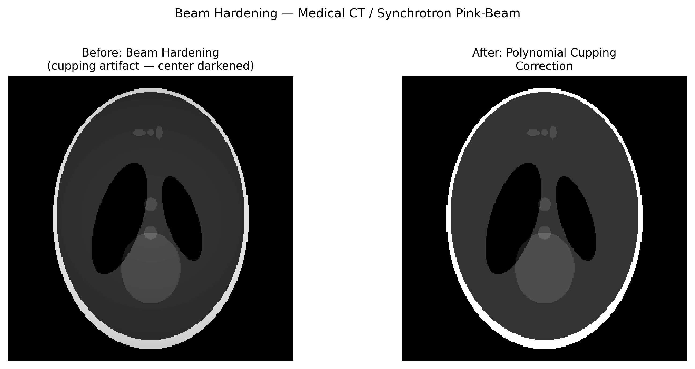

# 빔 경화 아티팩트(Beam Hardening Artifact)

## 분류

| 속성 | 값 |
|------|-----|
| **모달리티** | 의료 CT / 방사광 토모그래피 |
| **노이즈 유형** | 계통적(Systematic) |
| **심각도** | 주요(Major) |
| **빈도** | 흔함(Common) |
| **탐지 난이도** | 보통(Moderate) |
| **기원 도메인** | 의료 영상(CT) |

## 시각적 예시



> **이미지 출처:** 다색(polychromatic) 컵핑이 시뮬레이션된 합성 Shepp-Logan 팬텀. 왼쪽: 중심부가 어두워지는 컵핑 아티팩트가 나타나는 재구성. 오른쪽: 다항식 컵핑 보정 후. MIT 라이선스.

## 설명

빔 경화 아티팩트는 균일한 물체 내부에서 컵핑(중심이 어두워지는 현상)으로 나타나거나, 고밀도 구조물 사이에 어두운 띠/줄무늬로 나타납니다. 이는 다색(polychromatic) X선 빔이 물질을 통과할 때 저에너지 광자가 우선적으로 흡수되어, 빔의 유효 에너지가 깊이가 증가함에 따라 상승("경화")하기 때문에 발생합니다. 이는 표준 CT 재구성 알고리즘이 가정하는 단색(monochromatic) 빔 가정을 위배합니다.

**방사광 관련성:** 방사광 빔은 대체로 단색이지만, 핑크빔(pink-beam) 또는 광대역(broadband) 실험, 다층 모노크로메이터(multilayer monochromator) 설정, 고조파(harmonic) 오염 등은 유사한 스펙트럼 경화 효과를 유발할 수 있습니다. 또한 방사광 CT 데이터를 실험실 광원 마이크로 CT 데이터와 비교할 때 직접적으로 관련됩니다.

## 근본 원인

- 에너지 의존적 감쇠를 갖는 다색 X선 광원(Beer-Lambert 법칙의 붕괴)
- 저에너지 광자가 우선적으로 흡수됨 → 경로 길이가 증가할수록 유효 에너지 상승
- 재구성이 단색 빔을 가정 → 중심부 감쇠가 계통적으로 과소 추정됨
- 고밀도 물질(뼈, 금속)이 심한 국소 경화 유발

### 물리적 모델

```
I(d) = ∫ S(E) · exp(-μ(E)·d) dE   (polychromatic)
≠ I₀ · exp(-μ_eff·d)               (monochromatic assumption)
```

## 빠른 진단

```python
import numpy as np

def detect_cupping(slice_2d, center=None):
    """Detect beam hardening cupping artifact via radial profile."""
    ny, nx = slice_2d.shape
    if center is None:
        center = (ny // 2, nx // 2)
    Y, X = np.ogrid[:ny, :nx]
    r = np.sqrt((X - center[1])**2 + (Y - center[0])**2).astype(int)
    # Radial mean profile
    r_max = min(center[0], center[1], ny - center[0], nx - center[1])
    radial_mean = np.array([slice_2d[r == ri].mean() for ri in range(r_max)])
    # Cupping: center values significantly lower than periphery
    center_val = np.mean(radial_mean[:r_max // 4])
    edge_val = np.mean(radial_mean[3 * r_max // 4:])
    cupping_ratio = (edge_val - center_val) / edge_val
    print(f"Cupping ratio: {cupping_ratio:.3f} (>0.05 suggests beam hardening)")
    return cupping_ratio
```

## 탐지 방법

### 시각적 지표

- **컵핑 아티팩트:** 균일한 원통형 물체의 중심이 재구성 슬라이스에서 가장자리보다 어둡게 나타남
- **어두운 띠:** 두 고밀도 물체 사이(예: 뼈와 뼈 사이)에 어두운 줄무늬 발생
- **불균일한 CT 값:** 동일한 물질이 위치에 따라 서로 다른 Hounsfield/감쇠 값을 보임

### 자동 탐지

```python
import numpy as np
from scipy.optimize import curve_fit

def fit_cupping_profile(radial_profile):
    """Fit parabolic cupping to radial profile."""
    r = np.arange(len(radial_profile))
    r_norm = r / r.max()
    # Cupping model: a * r^2 + b
    def cupping_model(x, a, b):
        return a * x**2 + b
    popt, _ = curve_fit(cupping_model, r_norm, radial_profile)
    cupping_coeff = popt[0]
    return cupping_coeff  # positive = cupping present
```

## 보정 방법

### 전통적 접근법

1. **선형화(물 보정):** 알려진 물의 감쇠 곡선을 사용해 투영 데이터를 사전 보정
2. **다항식 보정:** 측정된 투영 값을 이상적인 단색 값으로 매핑하는 다항식 적합
3. **이중 에너지 CT(Dual-energy CT):** 두 가지 에너지로 데이터를 수집하여 물질 기저 함수로 분해
4. **반복 재구성:** 다색 순방향 투영을 반복 루프 안에서 모델링

```python
def polynomial_beam_hardening_correction(projections, order=3):
    """Simple polynomial beam hardening correction."""
    # Normalize projections
    p = projections.copy()
    p_flat = p.flatten()
    # Fit polynomial: corrected = sum(a_i * measured^i)
    # Coefficients typically determined from phantom calibration
    # Example: cubic correction
    corrected = p + 0.1 * p**2 - 0.01 * p**3  # coefficients from calibration
    return corrected
```

### AI/ML 접근법

- **딥러닝 BHC:** 다색/단색 페어 데이터로 학습된 CNN (Park et al., 2018)
- **SinoNet:** 사이노그램 도메인 보정 네트워크
- **반복 신경망:** 학습된 정규화를 갖춘 언롤드(unrolled) 최적화

## 주요 참고문헌

- **Brooks & Di Chiro (1976)** — "Beam hardening in X-ray reconstructive tomography" — 기초 기술
- **Herman (1979)** — CT의 빔 경화 보정 방법
- **Park et al. (2018)** — "A deep learning approach for beam hardening correction"
- **Kachelrieß et al. (2006)** — "Empirical cupping correction" (ECuP)
- **NIST XCOM database** — 에너지 의존 질량 감쇠 계수

## 방사광 데이터와의 관련성

| 시나리오 | 관련성 |
|----------|--------|
| 핑크빔 토모그래피 | 직접적 유사 사례 — 광대역 광원 |
| 다층 모노크로메이터 | 대역폭 ~1-2%로 약한 컵핑 유발 가능 |
| 고조파 오염 | 3차 고조파가 부차적 에너지 성분으로 작용 |
| 실험실 마이크로 CT 비교 | 방사광 vs 실험실 데이터 벤치마킹 시 필수 |
| 위상대비 영상 | 에너지 스펙트럼이 위상 복원 정확도에 영향 |

## 실제 보정 전후 사례

다음의 출판된 자료들은 실제 실험 보정 전후 비교를 제공합니다:

| 출처 | 유형 | 그림 | 설명 | 라이선스 |
|------|------|------|------|----------|
| [Barrett & Keat 2004](https://doi.org/10.1148/rg.246045065) | 논문 | Fig. 7 | Artifacts in CT: Recognition and Avoidance — 빔 경화 보정 전후 | -- |
| [UTCT — Artifacts and Partial-Volume Effects](https://www.ctlab.geo.utexas.edu/about-ct/artifacts-and-partial-volume-effects/) | 시설 문서 | 다수 | University of Texas CT Lab — 빔 경화 컵핑을 포함한 실제 CT 아티팩트 예시 | Public |
| [Chen et al. 2025](https://doi.org/10.3390/s25072088) | 논문 | Figs 3--5 | VGG 기반 빔 경화 보정 — 실제 CT 데이터의 보정 전후 비교 | CC BY 4.0 |

**출판된 보정 전후 비교를 포함한 주요 참고문헌:**
- **Barrett & Keat (2004)**: Fig. 7은 임상 CT에서 빔 경화 컵핑 아티팩트 보정 전후를 보여줌. DOI: 10.1148/rg.246045065
- **Chen et al. (2025)**: Figs 3-5는 실제 CT 데이터에 대한 VGG 기반 빔 경화 보정 전후를 보여줌. DOI: 10.3390/s25072088

> **추천 참고자료**: [UTCT — Artifacts and Partial-Volume Effects (University of Texas CT Lab)](https://www.ctlab.geo.utexas.edu/about-ct/artifacts-and-partial-volume-effects/)

## 관련 자료

- [Harmonics contamination](../spectroscopy/harmonics_contamination.md) — 관련된 스펙트럼 오염 이슈
- [Streak artifact](../tomography/streak_artifact.md) — 고밀도 물체 근처에서 빔 경화와 자주 동반 발생
