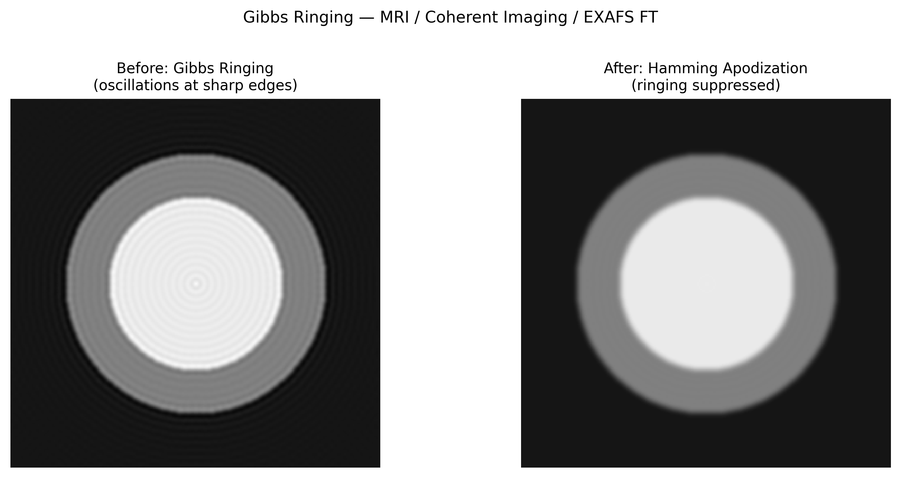

# Gibbs Ringing (Truncation Ringing)

## Classification

| Attribute | Value |
|-----------|-------|
| **Modality** | Medical MRI / Synchrotron Coherent Imaging |
| **Noise Type** | Computational |
| **Severity** | Moderate |
| **Frequency** | Common |
| **Detection Difficulty** | Easy |
| **Origin Domain** | Medical Imaging (MRI) |

## Visual Examples



> **Image source:** Synthetic sharp-edge phantom with Fourier truncation. Left: oscillations at step boundaries from finite frequency sampling. Right: after Hamming apodization. MIT license.

## Description

Gibbs ringing (also called truncation ringing or spectral leakage) manifests as oscillating bright/dark bands parallel to sharp edges. It arises from the finite sampling of frequency space (k-space in MRI, reciprocal space in diffraction), which is equivalent to multiplying the ideal infinite spectrum by a rectangular window function. The resulting sinc-function convolution produces characteristic overshoots and ringing at discontinuities.

**Synchrotron relevance:** Directly applicable to coherent diffraction imaging (CDI), ptychography with finite detector extent, and any Fourier-based reconstruction with limited frequency sampling.

## Root Cause

- Finite sampling in frequency/reciprocal space → truncation of Fourier series
- Sharp edges in real space require infinite frequency components to represent exactly
- Truncating at finite frequency → convolution with sinc function → ringing oscillations
- Worse with: low matrix size, sharp material boundaries, high-contrast interfaces

### Mathematical Origin

```
f(x) = Σ_{n=-N}^{N} c_n · exp(2πinx)   (truncated at ±N)
     → Gibbs overshoot ≈ 9% of discontinuity height (regardless of N)
```

## Quick Diagnosis

```python
import numpy as np
from scipy.signal import find_peaks

def detect_gibbs_ringing(line_profile):
    """Detect Gibbs ringing from oscillations near edges."""
    # Compute gradient to find edges
    gradient = np.gradient(line_profile)
    edge_positions = np.where(np.abs(gradient) > np.std(gradient) * 3)[0]
    if len(edge_positions) == 0:
        print("No sharp edges found")
        return False
    # Check for oscillations near edges
    for edge in edge_positions:
        region = line_profile[max(0, edge-20):min(len(line_profile), edge+20)]
        peaks, _ = find_peaks(region)
        valleys, _ = find_peaks(-region)
        if len(peaks) >= 2 and len(valleys) >= 2:
            print(f"Gibbs ringing detected near position {edge}")
            return True
    return False
```

## Detection Methods

### Visual Indicators

- Alternating bright/dark bands parallel to sharp edges
- Overshoot (bright line) immediately adjacent to high-contrast boundary
- Ringing amplitude ~9% of edge contrast, decaying with distance
- Most visible at high-contrast interfaces (bone/soft tissue, air/material)

### Automated Detection

```python
import numpy as np

def gibbs_overshoot_measurement(line_profile, edge_idx, side='right'):
    """Measure Gibbs overshoot percentage at a known edge."""
    if side == 'right':
        region = line_profile[edge_idx:edge_idx + 30]
    else:
        region = line_profile[max(0, edge_idx - 30):edge_idx]
    overshoot = np.max(region) - np.mean(region[10:])
    step_height = abs(line_profile[edge_idx + 5] - line_profile[edge_idx - 5])
    overshoot_pct = overshoot / step_height * 100
    return overshoot_pct  # Theoretical max ~8.95%
```

## Correction Methods

### Traditional Approaches

1. **Apodization / windowing:** Apply Hamming, Hanning, or Tukey window to k-space data before inverse FFT
2. **Zero-filling interpolation:** Increase matrix size (cosmetic improvement, no new information)
3. **Gegenbauer reconstruction:** Polynomial-based method that avoids Gibbs overshoot
4. **Total variation filtering:** Post-reconstruction TV denoising to suppress oscillations

```python
import numpy as np

def apply_hamming_apodization(kspace_data):
    """Apply Hamming window to suppress Gibbs ringing."""
    ny, nx = kspace_data.shape
    wy = np.hamming(ny)
    wx = np.hamming(nx)
    window = np.outer(wy, wx)
    return kspace_data * window
```

### AI/ML Approaches

- **HDNR (2018):** CNN-based Gibbs ringing removal for MRI (Muckley et al.)
- **Subvoxel-accuracy networks:** Learning de-ringing as super-resolution task

## Key References

- **Gibbs (1899)** — Original mathematical description of the phenomenon
- **Archibald & Gelb (2002)** — "Reducing the Gibbs phenomenon" — comprehensive methods review
- **Kellner et al. (2016)** — "Gibbs-ringing artifact removal based on local subvoxel-shifts" — widely used MRI method
- **Block et al. (2008)** — Compressed sensing MRI (implicitly handles Gibbs via sparsity)

## Relevance to Synchrotron Data

| Scenario | Relevance |
|----------|-----------|
| Coherent diffraction imaging (CDI) | Finite detector → Fourier truncation → ringing |
| Ptychography reconstruction | Limited reciprocal-space sampling at high q |
| Phase retrieval (Paganin) | Sharp phase boundaries produce ringing in reconstruction |
| EXAFS Fourier transform | Finite k-range causes ripples in R-space |
| Crystallography (Fourier maps) | Series termination ripples around atoms |

## Related Resources

- [Partial coherence](../ptychography/partial_coherence.md) — Related Fourier-space limitation
- [Sparse-angle artifact](../tomography/sparse_angle_artifact.md) — Incomplete sampling in angular domain
- [Statistical noise (EXAFS)](../spectroscopy/statistical_noise_exafs.md) — k-space truncation in spectroscopy
