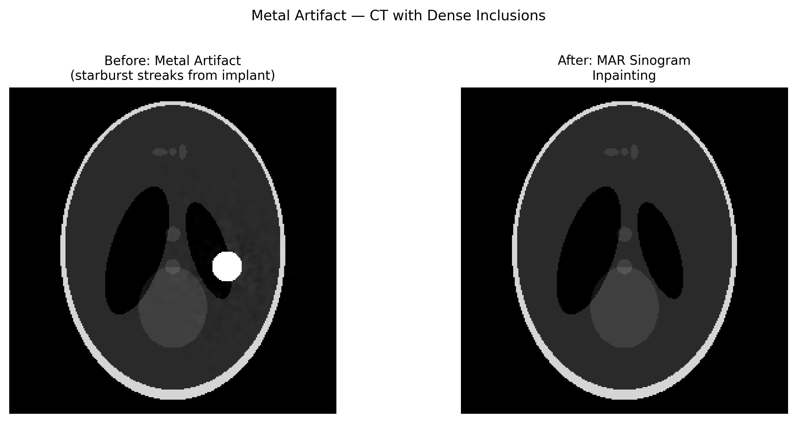

# 금속 아티팩트(Metal Artifact)

## 분류

| 속성 | 값 |
|------|-----|
| **모달리티** | 의료 CT / 방사광 토모그래피 |
| **노이즈 유형** | 계통적(Systematic) |
| **심각도** | 심각(Critical) |
| **빈도** | 가끔(Occasional) |
| **탐지 난이도** | 쉬움(Easy) |
| **기원 도메인** | 의료 영상(CT) |

## 시각적 예시



> **이미지 출처:** 고밀도 금속 삽입물이 있는 합성 팬텀. 왼쪽: 금속 물체에서 방사상으로 뻗어 나가는 별 모양(starburst) 줄무늬. 오른쪽: MAR 사이노그램 인페인팅 후. MIT 라이선스.

## 설명

금속 아티팩트는 강하게 감쇠하는 금속 물체(임플란트, 치과 충전재, 수술용 하드웨어)에 의해 발생하는 심각한 영상 왜곡입니다. 금속 주변에서 방사상으로 뻗어 나가는 밝은/어두운 줄무늬, "별 모양(starburst)" 패턴, 신호 공백으로 나타납니다. 이는 빔 경화, 광자 결핍, 산란, 부분 부피 효과가 금속 물체 근처에서 동시에 발생함으로써 야기되는 복합 아티팩트입니다.

**방사광 관련성:** 금속 함유 시료, 전극, 중금속 나노입자를 포함하는 촉매, 또는 고원자번호(high-Z) 성분이 있는 복합 재료를 영상화할 때 직접적으로 관련됩니다.

## 근본 원인

- **광자 결핍(Photon starvation):** 금속이 거의 모든 광자를 흡수 → 거의 0인 투과율 → 매우 노이즈가 큰 투영
- **빔 경화:** 두꺼운 금속을 통과할 때 극심한 스펙트럼 이동
- **비선형 부분 부피:** 금속-조직 복셀이 극단적인 감쇠 불일치를 가짐
- **산란:** 금속이 상당한 산란 신호 생성
- 결합된 효과 → 손상된 사이노그램 띠 → 재구성에 줄무늬 발생

## 빠른 진단

```python
import numpy as np

def detect_metal_projections(sinogram, threshold_percentile=99.5):
    """Identify projections severely affected by metal."""
    # Metal causes very high attenuation → near-zero transmission
    log_sino = -np.log(sinogram + 1e-10)
    high_atten = log_sino > np.percentile(log_sino, threshold_percentile)
    metal_angles = np.where(high_atten.any(axis=1))[0]
    print(f"Metal-affected projections: {len(metal_angles)} / {sinogram.shape[0]}")
    return metal_angles, high_atten
```

## 탐지 방법

### 시각적 지표

- 고밀도 물체에서 방사상으로 뻗어 나가는 밝은/어두운 줄무늬("starburst")
- 금속 위치의 신호 공백 또는 포화 영역
- 금속 주변 영역의 모든 디테일 손실
- 금속 물체 쌍을 잇는 줄무늬(예: 양측 고관절 임플란트)

### 자동 탐지

```python
import numpy as np
from scipy.ndimage import label

def segment_metal_regions(recon_slice, threshold=None):
    """Segment metal regions by extreme attenuation values."""
    if threshold is None:
        threshold = np.percentile(recon_slice, 99.5)
    metal_mask = recon_slice > threshold
    labeled, n_objects = label(metal_mask)
    print(f"Metal objects detected: {n_objects}")
    return metal_mask, labeled
```

## 보정 방법

### 전통적 접근법

1. **MAR (Metal Artifact Reduction):** 재구성에서 금속을 분할 → 순방향 투영 → 사이노그램의 금속 흔적 대체 → 재재구성
2. **NMAR (Normalized MAR):** 사전 영상 정규화로 개선된 MAR (Meyer et al., 2010)
3. **주파수 분리:** 저주파/고주파를 분리하여 독립적으로 보정
4. **반복 재구성:** 순방향 투영기에서 금속의 물리를 모델링

```python
def simple_mar_sinogram_inpainting(sinogram, metal_trace_mask):
    """Replace metal-affected sinogram regions with interpolation."""
    import scipy.interpolate as interp
    corrected = sinogram.copy()
    for i in range(sinogram.shape[0]):
        row = sinogram[i, :]
        mask = metal_trace_mask[i, :]
        if mask.any():
            good_idx = np.where(~mask)[0]
            bad_idx = np.where(mask)[0]
            if len(good_idx) > 2:
                f = interp.interp1d(good_idx, row[good_idx], kind='linear',
                                     fill_value='extrapolate')
                corrected[i, bad_idx] = f(bad_idx)
    return corrected
```

### AI/ML 접근법

- **ADN (Artifact Disentanglement Network):** Liao et al., 2019 — 아티팩트와 영상을 분리하는 학습
- **DuDoNet:** Lin et al., 2019 — 듀얼 도메인(사이노그램 + 영상) 보정 네트워크
- **cGAN-MAR:** 금속 아티팩트 감소를 위한 조건부 GAN

## 주요 참고문헌

- **Meyer et al. (2010)** — "Normalized metal artifact reduction (NMAR)"
- **Gjesteby et al. (2016)** — "Metal artifact reduction in CT: a comprehensive review"
- **Liao et al. (2019)** — "ADN: Artifact Disentanglement Network for metal artifact reduction"
- **Lin et al. (2019)** — "DuDoNet: Dual Domain Network for CT Metal Artifact Reduction"

## 방사광 데이터와의 관련성

| 시나리오 | 관련성 |
|----------|--------|
| 금속 함유 복합재 | 직접적 — 재료과학 시료의 금속 개재물 |
| 배터리 / 연료전지 영상 | 중금속(Pt, Ni 등)을 포함한 전극 |
| 지질 시료 | 고밀도 광물 입자가 유사한 아티팩트 생성 |
| 인-시튜(In-situ) 실험 | 금속 시료 홀더, 열전대, 압력 셀 |
| 문화재 영상 | 금속 체결구, 역사적 유물의 도금 |

## 실제 보정 전후 사례

다음의 출판된 자료들은 실제 실험 보정 전후 비교를 제공합니다:

| 출처 | 유형 | 그림 | 설명 | 라이선스 |
|------|------|------|------|----------|
| [Boas & Fleischmann 2012](https://doi.org/10.4329/wjr.v4.i4.156) | 논문 | Figs 1--4 | CT artifacts: Causes and reduction techniques — 종합적인 임상 금속 아티팩트 보정 전후 예시 | -- |
| [Katsura et al. 2018](https://doi.org/10.1148/rg.2018170102) | 논문 | 다수 | Current and novel techniques for metal artifact reduction at CT — 보정 전후 비교가 포함된 MAR 기법 | -- |
| [Liao et al. 2019 — ADN](https://doi.org/10.1016/j.media.2019.101554) | 논문 | 다수 | Artifact Disentanglement Network for Metal Artifact Reduction — 실제 임상 CT MAR 보정 전후 | -- |

**출판된 보정 전후 비교를 포함한 주요 참고문헌:**
- **Boas & Fleischmann (2012)**: Figs 1-4는 종합적 금속 아티팩트 보정 전후 예시를 보여줌. DOI: 10.4329/wjr.v4.i4.156
- **Katsura et al. (2018)**: 임상 보정 전후 예시가 포함된 현재와 신규 MAR 기법에 대한 RadioGraphics 리뷰. DOI: 10.1148/rg.2018170102

> **추천 참고자료**: [Boas & Fleischmann 2012 — CT artifacts: Causes and reduction techniques (World J. Radiol.)](https://doi.org/10.4329/wjr.v4.i4.156)

## 관련 자료

- [Streak artifact](../tomography/streak_artifact.md) — 금속 유발 줄무늬와 중첩
- [Beam hardening](beam_hardening.md) — 금속 아티팩트의 기여 메커니즘
