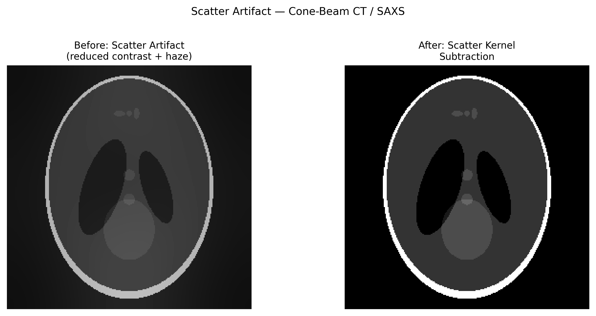

# Scatter Artifact

## Classification

| Attribute | Value |
|-----------|-------|
| **Modality** | Medical CT / Synchrotron Tomography |
| **Noise Type** | Systematic |
| **Severity** | Major |
| **Frequency** | Common |
| **Detection Difficulty** | Moderate |
| **Origin Domain** | Medical Imaging (CT) |

## Visual Examples



> **Image source:** Synthetic phantom with simulated Compton scatter background. Left: reduced contrast and haze from scatter. Right: after scatter kernel subtraction. MIT license.

## Description

Scatter artifacts arise when X-ray photons undergo Compton or coherent scattering within the sample and reach the detector at positions inconsistent with the primary beam path. This adds a broad, low-frequency background to projections, reducing contrast, introducing cupping artifacts, and creating shading/streaks between dense structures. In cone-beam geometries (common in both medical CBCT and synchrotron micro-CT), scatter can contribute 20-80% of detector signal.

## Root Cause

- **Compton scattering:** Photon changes direction after interacting with outer-shell electron (dominant at medical CT energies 30-120 keV)
- **Coherent (Rayleigh) scattering:** Photon redirected without energy loss (significant at lower energies)
- Scatter fraction increases with: sample size, cone angle, photon energy, detector area
- Scattered photons arrive at wrong detector positions → false signal added to projections

## Quick Diagnosis

```python
import numpy as np

def estimate_scatter_fraction(projection, air_region_mask):
    """Estimate scatter by measuring signal in known air regions."""
    air_signal = projection[air_region_mask].mean()
    max_signal = projection.max()
    scatter_fraction = air_signal / max_signal
    print(f"Estimated scatter fraction: {scatter_fraction:.1%}")
    print(f"{'⚠ High scatter' if scatter_fraction > 0.1 else 'Acceptable'}")
    return scatter_fraction
```

## Detection Methods

### Visual Indicators

- Reduced contrast compared to expected values
- Cupping artifact in uniform phantoms (similar to beam hardening)
- Diffuse shading between dense structures
- Signal in regions that should be "air" (zero attenuation)

### Automated Detection

```python
import numpy as np

def scatter_cupping_test(recon_slice, object_mask):
    """Differentiate scatter cupping from beam-hardening cupping."""
    # Scatter cupping is broader and lower frequency than BH cupping
    from scipy.ndimage import uniform_filter
    low_freq = uniform_filter(recon_slice, size=50)
    masked_profile = low_freq[object_mask]
    # Check for systematic low-frequency non-uniformity
    cv = np.std(masked_profile) / np.mean(masked_profile)
    return cv  # >0.05 suggests scatter contribution
```

## Correction Methods

### Traditional Approaches

1. **Anti-scatter grid:** Physical collimation before detector (reduces scatter at hardware level)
2. **Air-gap technique:** Increase sample-detector distance to reject wide-angle scatter
3. **Scatter kernel estimation:** Model scatter PSF and deconvolve from projections
4. **Monte Carlo simulation:** Simulate scatter distribution for given geometry and subtract
5. **Beam-blocker method:** Measure scatter directly using lead strips in beam path

```python
def simple_scatter_correction(projection, scatter_estimate):
    """Subtract estimated scatter from projection."""
    corrected = projection - scatter_estimate
    corrected[corrected < 0] = 0  # Avoid negative values
    return corrected
```

### AI/ML Approaches

- **Deep scatter estimation (DSE):** CNN trained on Monte Carlo scatter data (Maier et al., 2019)
- **Scatter-Net:** U-Net predicting scatter distribution from primary image
- **Physics-informed networks:** Embed forward scatter model in loss function

## Key References

- **Siewerdsen & Jaffray (2001)** — "Cone-beam computed tomography with a flat-panel imager: scatter estimation"
- **Rührnschopf & Klingenbeck (2011)** — "A general framework for scatter correction in CT" (2-part series)
- **Maier et al. (2019)** — "Deep scatter estimation" — learning-based approach
- **Star-Lack et al. (2009)** — "Efficient scatter correction using asymmetric kernels"

## Relevance to Synchrotron Data

| Scenario | Relevance |
|----------|-----------|
| Cone-beam micro-CT | Direct analog — significant scatter in CBCT geometry |
| Wide-field tomography | Large beam/detector → more scatter |
| Dense/thick samples | Scatter fraction increases dramatically |
| Phase-contrast imaging | Scatter confounds phase retrieval |
| SAXS/WAXS | Parasitic scattering is the dominant noise source |

## Related Resources

- [Beam hardening](beam_hardening.md) — Similar cupping appearance, different mechanism
- [Streak artifact](../tomography/streak_artifact.md) — Dense objects cause both scatter and streak artifacts
