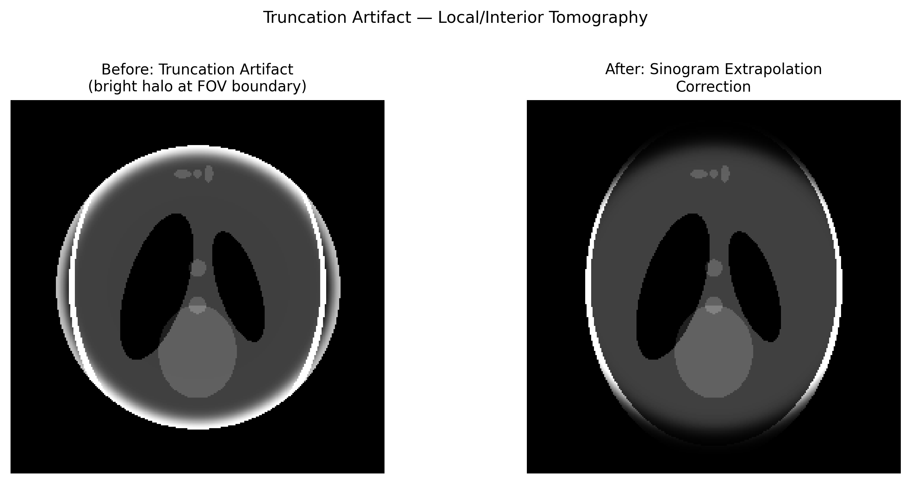

# Truncation Artifact (Field-of-View Clipping)

## Classification

| Attribute | Value |
|-----------|-------|
| **Modality** | Medical CT / Synchrotron Tomography |
| **Noise Type** | Systematic |
| **Severity** | Major |
| **Frequency** | Occasional |
| **Detection Difficulty** | Easy |
| **Origin Domain** | Medical Imaging (CT) |

## Visual Examples



> **Image source:** Synthetic phantom with simulated FOV clipping. Left: bright halo at FOV boundary from incomplete projections. Right: after sinogram extrapolation correction. MIT license.

## Description

Truncation artifacts occur when the sample extends beyond the detector's field of view (FOV) in one or more projections. The missing data causes bright edge halos and cupping-like intensity distortions in the reconstructed volume. In medical CT this is called "patient exceeds scan FOV"; in synchrotron tomography it happens with samples wider than the beam/detector width ("local tomography" or "region-of-interest CT").

## Root Cause

- Sample physically larger than detector width → projections are truncated at edges
- Backprojection of incomplete sinogram data → DC offset error and edge-brightening
- Mathematically: violation of sufficient sampling condition for Radon inversion
- Local/interior tomography: intentional partial-FOV scanning introduces similar systematic bias

## Quick Diagnosis

```python
import numpy as np

def detect_truncation(sinogram):
    """Check if sinogram is truncated at detector edges."""
    left_edge = sinogram[:, :5].mean(axis=1)
    right_edge = sinogram[:, -5:].mean(axis=1)
    center = sinogram[:, sinogram.shape[1]//2-2:sinogram.shape[1]//2+3].mean(axis=1)
    # Truncated if edge values are significantly non-zero (above background)
    threshold = center.mean() * 0.1
    left_truncated = (left_edge > threshold).sum() / len(left_edge)
    right_truncated = (right_edge > threshold).sum() / len(right_edge)
    print(f"Left edge active: {left_truncated:.1%}, Right edge active: {right_truncated:.1%}")
    if left_truncated > 0.3 or right_truncated > 0.3:
        print("⚠ Truncation likely — sample extends beyond FOV")
    return left_truncated, right_truncated
```

## Detection Methods

### Visual Indicators

- Bright or dark "halo" ring at the boundary of the reconstructed FOV
- Gradual intensity ramp (cupping or capping) across the reconstruction
- In sinogram: signal abruptly cut off at detector edges rather than fading to zero

### Automated Detection

```python
import numpy as np

def sinogram_edge_analysis(sinogram, margin=10):
    """Analyze sinogram edges for truncation."""
    edge_left = np.mean(np.abs(sinogram[:, :margin]))
    edge_right = np.mean(np.abs(sinogram[:, -margin:]))
    interior = np.mean(np.abs(sinogram[:, margin:-margin]))
    ratio = max(edge_left, edge_right) / (interior + 1e-10)
    return ratio  # >0.5 suggests truncation
```

## Correction Methods

### Traditional Approaches

1. **Sinogram extrapolation:** Pad sinogram edges with smoothly decaying functions (cosine, exponential)
2. **Water cylinder extension:** Assume object is embedded in water cylinder extending beyond FOV
3. **Helgason-Ludwig consistency:** Use data consistency conditions to estimate missing data
4. **Multi-scan stitching:** Acquire multiple offset scans and stitch sinograms

```python
def sinogram_padding(sinogram, pad_width=100, mode='cosine'):
    """Pad truncated sinogram with smooth extension."""
    n_angles, n_det = sinogram.shape
    padded = np.zeros((n_angles, n_det + 2 * pad_width))
    padded[:, pad_width:pad_width + n_det] = sinogram
    # Cosine decay at edges
    for i in range(pad_width):
        weight = 0.5 * (1 + np.cos(np.pi * i / pad_width))
        padded[:, pad_width - 1 - i] = sinogram[:, 0] * weight
        padded[:, pad_width + n_det + i] = sinogram[:, -1] * weight
    return padded
```

### AI/ML Approaches

- **Sinogram inpainting networks:** U-Net or GAN-based sinogram completion
- **DOLCE (2023):** Deep model-based local tomography reconstruction
- **Learned consistency:** Neural network enforcing data consistency for local CT

## Key References

- **Ohnesorge et al. (2000)** — Efficient correction for CT truncation artifacts
- **Hsieh et al. (2004)** — "A novel reconstruction for truncation artifacts"
- **Kudo et al. (2008)** — Interior tomography theory (exact interior reconstruction)
- **Bao et al. (2019)** — "Convolutional sparse coding for truncation artifact reduction in CT"

## Relevance to Synchrotron Data

| Scenario | Relevance |
|----------|-----------|
| Local / interior tomography | Direct application — common at synchrotron for large samples |
| Region-of-interest scanning | Intentional partial FOV to maximize resolution |
| Multi-resolution stitched CT | Stitching boundaries can create similar edge effects |
| Phase-contrast local CT | Phase retrieval + truncation interact non-trivially |

## Real-World Before/After Examples

The following published sources provide real experimental before/after comparisons:

| Source | Type | Figure/Location | Description | License |
|--------|------|-----------------|-------------|---------|
| [Ohnesorge et al. 2000](https://doi.org/10.1118/1.598535) | Paper | Multiple | Efficient correction for CT image artifacts caused by objects extending outside the scan field of view — before/after truncation correction | -- |

**Key references with published before/after comparisons:**
- **Ohnesorge et al. (2000)**: Efficient correction for CT truncation artifacts with before/after examples showing FOV extension. DOI: 10.1118/1.598535

## Related Resources

- [Rotation center error](../tomography/rotation_center_error.md) — Can compound truncation effects
- [Sparse-angle artifact](../tomography/sparse_angle_artifact.md) — Both cause incomplete-data reconstruction issues
- [Stitching artifact](../ptychography/stitching_artifact.md) — Related boundary artifact in tiled acquisitions
