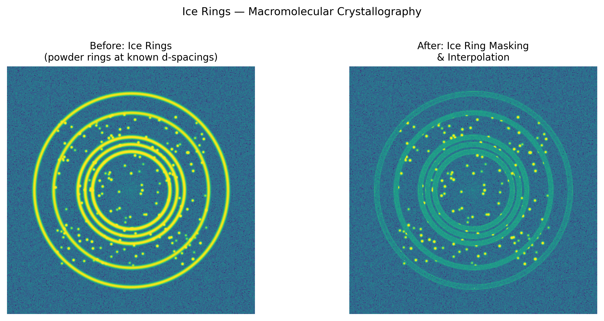

# Ice Rings (Crystallography)

## Classification

| Attribute | Value |
|-----------|-------|
| **Modality** | Macromolecular Crystallography (MX) |
| **Noise Type** | Systematic |
| **Severity** | Major |
| **Frequency** | Common |
| **Detection Difficulty** | Easy |
| **Origin Domain** | Synchrotron Crystallography (Diamond, ESRF, APS, SPring-8) |

## Visual Examples



> **Image source:** Synthetic 2D diffraction pattern with simulated ice powder rings at known d-spacings. Left: ice rings overlapping Bragg reflections. Right: after ice ring masking and interpolation. MIT license.

## Description

Ice rings are sharp, concentric powder-diffraction rings appearing on crystallography diffraction images at specific d-spacings corresponding to crystalline ice (hexagonal Ih or cubic Ic). They arise from ice forming on the sample, loop, or cryo-stream, and can obscure Bragg reflections, corrupt intensity measurements, and introduce systematic errors in structure determination.

## Root Cause

- **Cryo-cooling artifacts:** Flash-cooling crystal to 100K can form crystalline ice if cryoprotection is inadequate
- **Cryo-stream icing:** Moisture condensation on cold stream or sample mount
- **Incomplete vitrification:** Cryoprotectant concentration too low → ice crystals in mother liquor
- **Ice accumulation over time:** Long data collections accumulate ice from humid air

### Characteristic d-spacings (Hexagonal Ice Ih)

```
d = 3.90 Å  (strongest)
d = 3.67 Å
d = 3.44 Å  (strong)
d = 2.67 Å
d = 2.25 Å
d = 1.92 Å
d = 1.72 Å
```

## Quick Diagnosis

```python
import numpy as np

# Known ice ring d-spacings (Angstroms) for hexagonal ice
ICE_D_SPACINGS = [3.90, 3.67, 3.44, 2.67, 2.25, 1.92, 1.72]

def check_ice_rings(resolution_bins, mean_intensity_per_bin, wavelength=1.0):
    """Check for ice rings by looking for intensity spikes at known d-spacings."""
    ice_resolutions = [d for d in ICE_D_SPACINGS]
    baseline = np.median(mean_intensity_per_bin)
    threshold = baseline + 3 * np.std(mean_intensity_per_bin)
    ice_detected = []
    for d_ice in ice_resolutions:
        # Find nearest resolution bin
        idx = np.argmin(np.abs(resolution_bins - d_ice))
        if mean_intensity_per_bin[idx] > threshold:
            ice_detected.append(d_ice)
            print(f"⚠ Ice ring detected at d = {d_ice:.2f} Å")
    if not ice_detected:
        print("No ice rings detected")
    return ice_detected
```

## Detection Methods

### Visual Indicators

- Bright concentric rings on diffraction image (powder-pattern rings)
- Rings at specific, known d-spacings of ice
- Rings sharper than background scatter but broader than Bragg spots
- Intensity vs resolution plot shows spikes at ice d-spacings

### Automated Detection

```python
import numpy as np

def azimuthal_intensity_at_d(image_2d, center, d_spacing, wavelength,
                              detector_distance, pixel_size):
    """Compute azimuthal intensity profile at a specific d-spacing."""
    theta = np.arcsin(wavelength / (2 * d_spacing))
    r_pixels = detector_distance * np.tan(2 * theta) / pixel_size
    ny, nx = image_2d.shape
    Y, X = np.ogrid[:ny, :nx]
    R = np.sqrt((X - center[1])**2 + (Y - center[0])**2)
    ring_mask = np.abs(R - r_pixels) < 2  # 2-pixel width
    ring_intensity = image_2d[ring_mask].mean() if ring_mask.any() else 0
    return ring_intensity
```

## Correction Methods

### Prevention

1. **Proper cryoprotection:** Optimize cryoprotectant (glycerol, PEG, ethylene glycol) concentration
2. **Dry cryo-stream:** Ensure nitrogen stream is moisture-free
3. **Annealing:** Briefly warm crystal and re-cool to improve vitrification
4. **Humidity control:** Use dehumidifier around diffractometer

### Data Processing

1. **Resolution shell exclusion:** Exclude affected resolution bins from scaling/refinement
2. **Ice ring flagging:** Mark reflections near ice d-spacings as unreliable
3. **Background modeling:** Model ice rings as additional background component

```python
def flag_ice_ring_reflections(hkl_data, d_spacings_ice=None, tolerance=0.02):
    """Flag reflections that fall within ice ring d-spacings."""
    if d_spacings_ice is None:
        d_spacings_ice = [3.90, 3.67, 3.44, 2.67, 2.25, 1.92, 1.72]
    flags = np.zeros(len(hkl_data['d']), dtype=bool)
    for d_ice in d_spacings_ice:
        flags |= np.abs(hkl_data['d'] - d_ice) < tolerance
    n_flagged = flags.sum()
    print(f"Flagged {n_flagged} reflections ({n_flagged/len(flags):.1%}) near ice rings")
    return flags
```

### Software Tools

- **DIALS** — Automatic ice ring detection and exclusion (Diamond Light Source)
- **XDS** — EXCLUDE_RESOLUTION_RANGE keyword
- **autoPROC** — Automated ice ring handling (Global Phasing)
- **CCP4 / AIMLESS** — Resolution shell rejection

## Key References

- **Parkhurst et al. (2017)** — Ice ring detection in DIALS
- **Thorn et al. (2017)** — "Subatomic resolution crystal structures: ice ring artifacts and modelling"
- **Garman & Weik (2023)** — "Radiation damage in macromolecular crystallography" (review)

## Facility Benchmarks

| Facility | Approach |
|----------|----------|
| Diamond I03/I04 | DIALS automatic ice ring detection pipeline |
| ESRF ID23/ID30 | MXCuBE automated data collection with ice detection |
| SPring-8 BL32XU | ZOO automated system with ice monitoring |
| APS GM/CA | JBluIce with ice ring warning |
| NSLS-II FMX/AMX | LSDC with automated quality metrics |

## Real-World Before/After Examples

The following published sources provide real experimental before/after comparisons:

| Source | Type | Figure | Description | License |
|--------|------|--------|-------------|---------|
| [Parkhurst et al. 2017](https://doi.org/10.1107/S2059798317010348) | Paper | Fig. 1 | Background modelling in the presence of ice rings — ice ring masking before/after in real MX data | BSD-3 |
| [DIALS documentation](https://dials.github.io/) | Software docs | Multiple | DIALS diffraction integration software with ice ring detection and masking tools | BSD-3 |

**Key references with published before/after comparisons:**
- **Parkhurst et al. (2017)**: Fig. 1 shows ice ring masking before/after in real crystallographic data. DOI: 10.1107/S2059798317010348

> **Recommended reference**: [Parkhurst et al. 2017 — DIALS integration package (Acta Cryst D)](https://doi.org/10.1107/S2059798317010348)

## Related Resources

- [Radiation damage](../spectroscopy/radiation_damage.md) — Both are cryo-related experimental issues
- [Ring artifact](../tomography/ring_artifact.md) — Different origin but similar ring appearance
