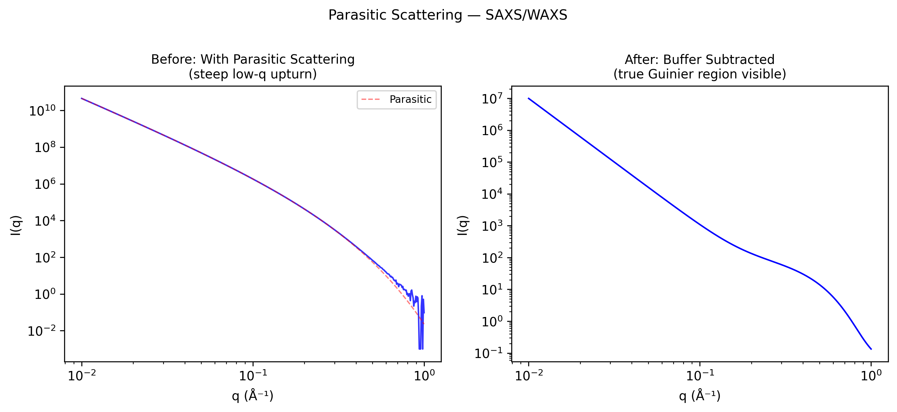

# Parasitic Scattering (SAXS/WAXS)

## Classification

| Attribute | Value |
|-----------|-------|
| **Modality** | SAXS / WAXS |
| **Noise Type** | Instrumental |
| **Severity** | Critical |
| **Frequency** | Always |
| **Detection Difficulty** | Moderate |
| **Origin Domain** | Synchrotron Scattering (ESRF, DESY, Diamond, SPring-8) |

## Visual Examples



> **Image source:** Synthetic SAXS I(q) curve with simulated parasitic scattering at low q. Left: steep upturn from slit/window scatter. Right: after buffer subtraction revealing true Guinier region. MIT license.

## Description

Parasitic scattering is unwanted background signal from X-ray interactions with optical components (slits, windows, air gaps, beamstop) rather than the sample. In SAXS, this is the dominant noise source at low-q, where the scientific signal of interest (large-scale structures) overlaps with scattering from beam-defining slits and windows. Proper subtraction of parasitic scatter is essential for reliable structural analysis.

## Root Cause

- **Slit scattering:** X-rays hitting slit edges produce divergent scatter at low angles
- **Window scattering:** Kapton, mica, or diamond windows contribute broad background
- **Air scattering:** Any air path length adds diffuse background (N₂, O₂ scattering)
- **Beamstop scatter:** Beam stop and its support wire scatter at low q
- **Flight tube imperfections:** Residual gas in vacuum path, window fogging

## Quick Diagnosis

```python
import numpy as np

def check_parasitic_scatter(q, I_sample, I_buffer, I_empty):
    """Assess parasitic scattering contribution."""
    # Parasitic scatter: remains after buffer subtraction
    I_corrected = I_sample - I_buffer
    I_parasitic = I_buffer - I_empty
    # Check ratio at low q
    low_q_mask = q < q[len(q)//10]
    ratio = I_parasitic[low_q_mask].mean() / I_sample[low_q_mask].mean()
    print(f"Parasitic/sample ratio at low-q: {ratio:.2%}")
    if ratio > 0.5:
        print("⚠ High parasitic scattering — check slits and windows")
    return ratio
```

## Detection Methods

### Visual Indicators

- Steep upturn in I(q) at very low q (below sample's true Guinier region)
- Background shape changes with slit settings but not with sample
- Asymmetric 2D pattern (parasitic scatter follows slit geometry)
- Signal persists even with no sample in beam

### Automated Detection

```python
import numpy as np

def parasitic_slope_test(q, I_q, q_min=0.005, q_max=0.02):
    """Check for parasitic scatter by power-law slope at low q."""
    mask = (q >= q_min) & (q <= q_max)
    log_q, log_I = np.log10(q[mask]), np.log10(I_q[mask])
    slope = np.polyfit(log_q, log_I, 1)[0]
    # Parasitic: slope ~ -4 (Porod from slits); Real Guinier: slope ~ -q²Rg²/3
    print(f"Low-q slope: {slope:.1f} (< -3 suggests parasitic scattering)")
    return slope
```

## Correction Methods

### Traditional Approaches

1. **Empty beam / buffer subtraction:** Measure empty cell + buffer, subtract from sample
2. **Guard slits:** Second slit set to intercept parasitic scatter from primary slits
3. **Scatterless slits:** Single-crystal (Ge/Si) slits that don't produce parasitic scatter
4. **Vacuum flight tube:** Eliminate air scattering with evacuated path
5. **Azimuthal masking:** Mask non-isotropic parasitic features in 2D pattern

```python
def saxs_background_subtraction(I_sample, I_buffer, I_empty,
                                  transmission_sample, transmission_buffer):
    """Standard SAXS background subtraction with transmission correction."""
    I_corrected = (I_sample / transmission_sample -
                   I_buffer / transmission_buffer)
    return I_corrected
```

### Software Tools

- **SASView / sasmodels** — Comprehensive SAXS/SANS analysis with background handling
- **ATSAS (EMBL)** — PRIMUS, GNOM with automatic background estimation
- **pyFAI** — Fast azimuthal integration with masking support (ESRF)
- **Dawn Science** — Diamond Light Source processing pipeline

## Key References

- **Glatter & Kratky (1982)** — "Small Angle X-ray Scattering" — foundational textbook
- **Pauw (2013)** — "Everything SAXS: small-angle scattering pattern collection and correction"
- **Li et al. (2008)** — "Scatterless hybrid metal–single-crystal slit for SAXS"
- **ESRF ID02 beamline documentation** — Parasitic scatter mitigation strategies

## Facility Benchmarks

| Facility | Beamline | Approach |
|----------|----------|----------|
| ESRF | ID02 | Scatterless slits + 34m vacuum path |
| DESY PETRA III | P12 (EMBL) | Automated buffer subtraction pipeline |
| Diamond | I22 | Guard slits + evacuated camera |
| SPring-8 | BL40B2 | Precision slit system + He path |
| APS | 12-ID-B | Pinhole collimation + vacuum |

## Real-World Before/After Examples

The following published sources provide real experimental before/after comparisons:

| Source | Type | Figure/Location | Description | License |
|--------|------|-----------------|-------------|---------|
| [Ashiotis et al. 2015 — pyFAI](https://doi.org/10.1107/S1600576715004306) | Paper | Multiple | pyFAI: a Python library for high performance azimuthal integration — azimuthal integration with masking examples for parasitic scatter removal | MIT |
| [pyFAI documentation](https://pyfai.readthedocs.io/) | Software docs | Tutorials | pyFAI azimuthal integration tutorials showing masking of parasitic scattering and beamstop shadows | MIT |

**Key references with published before/after comparisons:**
- **Ashiotis et al. (2015)**: pyFAI azimuthal integration with masking examples showing parasitic scatter removal. DOI: 10.1107/S1600576715004306

## Related Resources

- [Scatter artifact](../medical_imaging/scatter_artifact.md) — Scatter in CT geometry
- [Beam intensity drop](../tomography/beam_intensity_drop.md) — I0 monitoring relevant to normalization
