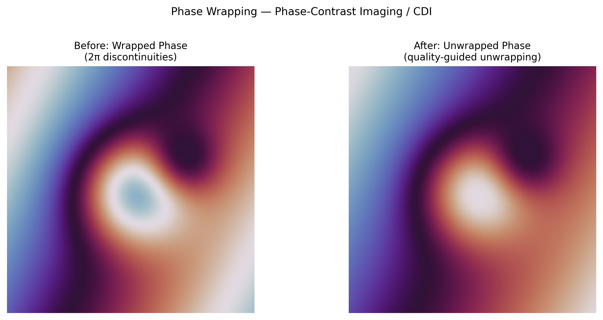

# Phase Wrapping Artifact

## Classification

| Attribute | Value |
|-----------|-------|
| **Modality** | Phase-Contrast Imaging / CDI / Interferometry |
| **Noise Type** | Computational |
| **Severity** | Critical |
| **Frequency** | Common |
| **Detection Difficulty** | Moderate |
| **Origin Domain** | Synchrotron Phase-Contrast Imaging (ESRF, Diamond, SLS) |

## Visual Examples



> **Image source:** Synthetic phase map with range exceeding [-π, π]. Left: wrapped phase with 2π discontinuities. Right: after quality-guided phase unwrapping recovering true continuous phase. MIT license.

## Description

Phase wrapping occurs when the retrieved phase exceeds the principal value range [-π, π], causing abrupt 2π discontinuities in the phase map. These artificial "jumps" create false boundaries, corrupt quantitative phase measurements, and mislead segmentation algorithms. It is a fundamental ambiguity in any phase retrieval method, analogous to the aliasing problem in signal processing.

**Multi-facility relevance:** Encountered at all synchrotron facilities doing phase-contrast imaging (ESRF ID19, Diamond I13, SLS TOMCAT), grating interferometry, ptychography, and holographic methods.

## Root Cause

- Phase is inherently cyclic: φ and φ + 2πn produce identical measurements
- Phase retrieval algorithms return wrapped phase in [-π, π]
- True phase of thick or dense samples can exceed π → wrapping occurs
- Large phase gradients (sharp density interfaces) → undersampled phase → wrapping
- In interferometry: fringe analysis inherently yields wrapped phase

### Mathematical Description

```
φ_wrapped(x) = φ_true(x) mod 2π - π
When φ_true > π: discontinuous jump of -2π appears
```

## Quick Diagnosis

```python
import numpy as np

def detect_phase_wraps(phase_map, threshold=5.0):
    """Detect phase wrapping by finding large phase jumps."""
    dy = np.diff(phase_map, axis=0)
    dx = np.diff(phase_map, axis=1)
    # Phase wraps cause jumps near ±2π
    wrap_y = np.abs(dy) > threshold
    wrap_x = np.abs(dx) > threshold
    n_wraps = wrap_y.sum() + wrap_x.sum()
    print(f"Phase wraps detected: {n_wraps}")
    print(f"Wrap fraction: {n_wraps / phase_map.size:.2%}")
    # Create wrap location map
    wrap_map = np.zeros_like(phase_map, dtype=bool)
    wrap_map[:-1, :] |= wrap_y
    wrap_map[:, :-1] |= wrap_x
    return wrap_map
```

## Detection Methods

### Visual Indicators

- Sharp, discontinuous "cliff" lines in otherwise smooth phase maps
- Phase values abruptly jump from +π to -π (or vice versa)
- "Streaks" of anomalous phase at dense/thick interfaces
- Histogram of phase values shows pile-up at ±π boundaries

### Automated Detection

```python
import numpy as np

def phase_gradient_reliability(phase_map):
    """Compute reliability map for phase unwrapping (Herraez et al.)."""
    dy = np.diff(phase_map, axis=0, prepend=phase_map[:1, :])
    dx = np.diff(phase_map, axis=1, prepend=phase_map[:, :1])
    # Wrap gradients to [-π, π]
    dy = np.angle(np.exp(1j * dy))
    dx = np.angle(np.exp(1j * dx))
    # Second differences → reliability (lower = more reliable)
    dyy = np.diff(dy, axis=0, prepend=dy[:1, :])
    dxx = np.diff(dx, axis=1, prepend=dx[:, :1])
    dxy = np.diff(dy, axis=1, prepend=dy[:, :1])
    reliability = np.sqrt(dyy**2 + dxx**2 + dxy**2)
    return reliability
```

## Correction Methods

### Traditional Approaches

1. **Path-following unwrapping:** Goldstein (branch-cut), Flynn (minimum discontinuity)
2. **Quality-guided unwrapping:** Unwrap from most reliable pixels first (Herráez et al., 2002)
3. **Least-squares unwrapping:** Minimize ∇²(φ_unwrapped - φ_wrapped) — global method
4. **Multi-distance phase retrieval:** Multiple sample-detector distances reduce ambiguity
5. **Dual-energy phase retrieval:** Two energies to resolve wrapping

```python
def quality_guided_unwrap_2d(wrapped_phase):
    """Simple quality-guided 2D phase unwrapping."""
    from skimage.restoration import unwrap_phase
    # scikit-image implements quality-guided unwrapping
    unwrapped = unwrap_phase(wrapped_phase)
    return unwrapped
```

### AI/ML Approaches

- **PhaseNet (2019):** Deep learning phase unwrapping (Wang et al.)
- **DeepPhaseUnwrap:** U-Net predicting unwrapped phase from wrapped input
- **Physics-informed unwrapping:** Neural network with phase-consistency loss

### Software Tools

- **scikit-image** — `skimage.restoration.unwrap_phase` (quality-guided)
- **SNAPHU** — Statistical-cost phase unwrapping (originally for InSAR)
- **PyPhase** — Phase retrieval and unwrapping for X-ray imaging

## Key References

- **Goldstein et al. (1988)** — "Satellite radar interferometry: two-dimensional phase unwrapping"
- **Herráez et al. (2002)** — "Fast two-dimensional phase-unwrapping algorithm based on sorting by reliability"
- **Ghiglia & Pritt (1998)** — "Two-Dimensional Phase Unwrapping: Theory, Algorithms, and Software" — definitive textbook
- **Paganin et al. (2002)** — "Simultaneous phase and amplitude extraction from a single defocused image"

## Facility Benchmarks

| Facility | Beamline | Phase Method |
|----------|----------|--------------|
| ESRF | ID19 | Propagation-based phase contrast + Paganin retrieval |
| Diamond | I13 | Inline phase contrast + multi-distance retrieval |
| SLS TOMCAT | X02DA | Single-distance Paganin + grating interferometry |
| SPring-8 | BL20B2 | Talbot-Lau grating interferometry |
| APS | 32-ID | Propagation phase contrast, Zernike phase contrast |

## Real-World Before/After Examples

The following published sources provide real experimental before/after comparisons:

| Source | Type | Figure | Description | License |
|--------|------|--------|-------------|---------|
| [scikit-image unwrap_phase](https://scikit-image.org/docs/stable/api/skimage.restoration.html) | Software docs | API examples | Phase unwrapping function with examples showing wrapped vs unwrapped phase maps | BSD-3 |

> **Recommended reference**: [scikit-image — unwrap_phase (skimage.restoration)](https://scikit-image.org/docs/stable/api/skimage.restoration.html)

## Related Resources

- [Position error](../ptychography/position_error.md) — Phase errors in ptychographic reconstruction
- [Gibbs ringing](../medical_imaging/gibbs_ringing.md) — Fourier-related reconstruction artifacts
- [Partial coherence](../ptychography/partial_coherence.md) — Coherence affects phase retrieval quality
