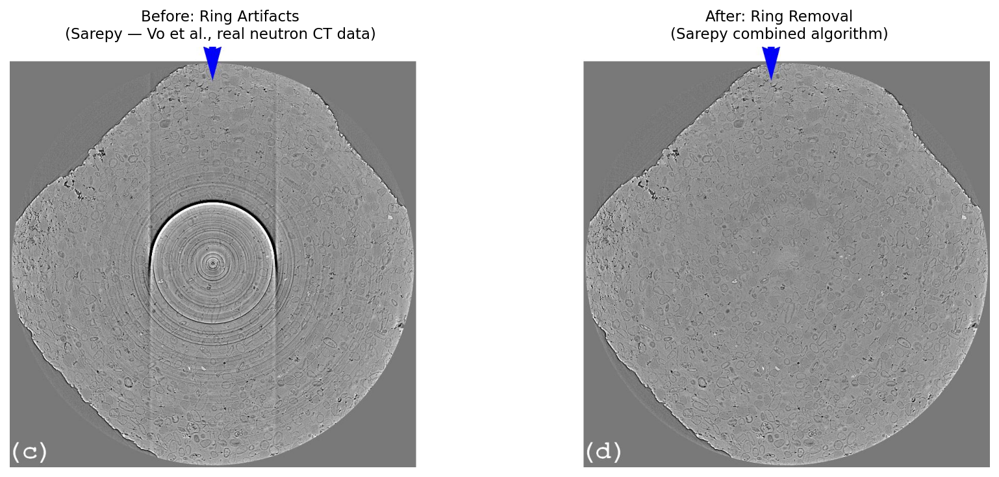

# 링 아티팩트(Ring Artifact)

## 분류

| 속성 | 값 |
|------|-----|
| **모달리티** | 토모그래피 |
| **노이즈 유형** | 기기(Instrumental) |
| **심각도** | 심각(Critical) |
| **빈도** | 흔함(Common) |
| **탐지 난이도** | 쉬움(Easy) |

## 시각적 예시



*실제 중성자 CT 데이터에서의 링 아티팩트 보정 전후 비교. 출처: [Sarepy](https://github.com/nghia-vo/sarepy) (BSD-3 라이선스)*

**왼쪽(보정 전):** 재구성된 CT 슬라이스에서 회전축을 중심으로 동심원 형태의 링 패턴이 관찰됩니다.
**오른쪽(보정 후):** 스트라이프 제거 알고리즘 적용 후 링이 제거되어 깨끗한 재구성 이미지를 확인할 수 있습니다.

## 설명

링 아티팩트(Ring Artifact)는 재구성된 CT 슬라이스에서 회전축을 중심으로 나타나는 동심원 형태의 원형 패턴입니다. 이 아티팩트는 검출기의 불량/과열/보정 오류 픽셀이 사이노그램(sinogram)에서 일정한 값을 가진 수직 열(column)을 생성하여 발생합니다.

사이노그램에서 수직 줄무늬(vertical stripe)로 나타나는 것이 특징이며, 이 줄무늬가 역투영(back-projection)을 통해 재구성되면 원형 링으로 변환됩니다. 줄무늬의 위치가 회전축으로부터의 거리에 해당하므로, 중심에 가까운 줄무늬일수록 작은 반경의 링을 생성합니다.

링 아티팩트는 방사광 토모그래피에서 가장 흔하게 발생하는 아티팩트 중 하나이며, 정량적 분석(밀도 측정, 기공률 계산 등)에 심각한 영향을 미칩니다.

## 근본 원인

1. **검출기 불량 픽셀(Dead/Hot Pixels):** 응답하지 않거나 비정상적으로 높은 값을 출력하는 픽셀
2. **검출기 보정 오류:** 플랫필드 보정 후에도 남아 있는 픽셀 간 감도 차이
3. **섬광체(Scintillator) 결함:** 섬광체 표면의 먼지, 흠집, 또는 불균일한 두께
4. **검출기 비선형성:** 특정 픽셀의 비선형 응답 특성
5. **플랫필드와 데이터 수집 사이의 시간 차이:** 검출기 상태가 변하면서 보정 정확도 저하

## 빠른 진단

사이노그램에서 의심스러운 수직 열을 빠르게 탐지하는 코드:

```python
import numpy as np

col_std = np.std(sinogram, axis=0)
col_mean = np.mean(sinogram, axis=0)
outlier_cols = np.where(np.abs(col_std - np.median(col_std)) > 3 * np.std(col_std))[0]
print(f"Suspicious columns: {outlier_cols}")
```

이 코드는 각 열의 표준편차를 계산하여 중앙값에서 3시그마 이상 벗어나는 열을 이상치로 식별합니다. 이러한 열은 사이노그램의 수직 줄무늬(즉, 재구성 시 링 아티팩트)에 해당합니다.

## 탐지 방법

### 시각적 지표

- **사이노그램:** 수직 방향의 밝거나 어두운 줄무늬 확인
- **재구성 슬라이스:** 회전축 중심의 동심원 패턴 확인
- **극좌표 변환:** 재구성 이미지를 극좌표로 변환하면 링이 수평선으로 나타나 탐지가 용이

### 자동 탐지

```python
import numpy as np
from scipy import ndimage

def detect_ring_artifacts(sinogram, threshold=5.0):
    """
    사이노그램에서 링 아티팩트를 유발하는 줄무늬를 탐지합니다.

    Parameters
    ----------
    sinogram : np.ndarray
        2D 사이노그램 배열 (angles x detector_columns)
    threshold : float
        MAD 기반 이상치 탐지 임계값 (기본값: 5.0)

    Returns
    -------
    dict
        탐지 결과를 담은 딕셔너리
    """
    # 열별 통계 계산
    col_means = np.mean(sinogram, axis=0)
    col_stds = np.std(sinogram, axis=0)

    # MAD(Median Absolute Deviation) 기반 강건한 점수 계산
    median_mean = np.median(col_means)
    mad_mean = np.median(np.abs(col_means - median_mean))
    mad_mean = mad_mean * 1.4826  # 정규분포 일관성 상수

    median_std = np.median(col_stds)
    mad_std = np.median(np.abs(col_stds - median_std))
    mad_std = mad_std * 1.4826

    # 이상 열 탐지
    if mad_mean > 0:
        mean_scores = np.abs(col_means - median_mean) / mad_mean
    else:
        mean_scores = np.zeros_like(col_means)

    if mad_std > 0:
        std_scores = np.abs(col_stds - median_std) / mad_std
    else:
        std_scores = np.zeros_like(col_stds)

    combined_scores = np.maximum(mean_scores, std_scores)
    stripe_cols = np.where(combined_scores > threshold)[0]

    # 심각도 분류
    severity = "none"
    if len(stripe_cols) > 0:
        max_score = np.max(combined_scores[stripe_cols])
        if max_score > 20 or len(stripe_cols) > sinogram.shape[1] * 0.05:
            severity = "critical"
        elif max_score > 10 or len(stripe_cols) > sinogram.shape[1] * 0.01:
            severity = "major"
        else:
            severity = "minor"

    return {
        "stripe_columns": stripe_cols,
        "scores": combined_scores,
        "severity": severity,
        "num_stripes": len(stripe_cols),
        "max_score": float(np.max(combined_scores)) if len(combined_scores) > 0 else 0.0
    }
```

## 해결 및 완화

### 예방 (데이터 수집 전)

- 실험 전 검출기 보정 상태를 확인합니다
- 플랫필드(flat-field) 이미지를 데이터 수집 시점에 가깝게 촬영합니다
- 섬광체 표면을 청결하게 유지합니다
- 불량 픽셀 맵을 정기적으로 업데이트합니다
- 데이터 수집 중 주기적으로 플랫필드를 재촬영합니다(동적 플랫필드)

### 보정 — 전통적 방법

TomoPy에서 제공하는 세 가지 주요 스트라이프 제거 방법:

```python
import tomopy

# 방법 1: 푸리에-웨이블릿 기반 스트라이프 제거
# 넓고 부드러운 줄무늬에 효과적
cleaned_sino_fw = tomopy.remove_stripe_fw(
    sinogram,
    level=7,       # 웨이블릿 분해 레벨
    wname='sym16', # 웨이블릿 함수
    sigma=1,       # 감쇠 계수
    pad=True       # 경계 아티팩트 방지
)

# 방법 2: Vo의 결합 스트라이프 제거 (권장)
# 대형, 전폭, 비전폭 줄무늬를 단계적으로 제거
cleaned_sino_vo = tomopy.remove_all_stripe(
    sinogram,
    snr=3,         # 큰 줄무늬 감도
    la_size=61,    # 큰 줄무늬 창 크기
    sm_size=21     # 작은 줄무늬 창 크기
)

# 방법 3: 사이노그램 열 직접 보간
# 알려진 불량 열에 대한 직접 보간
import numpy as np
from scipy.interpolate import interp1d

def interpolate_bad_columns(sinogram, bad_cols):
    """불량 열을 인접 열로 보간합니다."""
    cleaned = sinogram.copy()
    all_cols = np.arange(sinogram.shape[1])
    good_cols = np.setdiff1d(all_cols, bad_cols)

    for row in range(sinogram.shape[0]):
        f = interp1d(good_cols, sinogram[row, good_cols],
                     kind='linear', fill_value='extrapolate')
        cleaned[row, bad_cols] = f(bad_cols)

    return cleaned
```

### 보정 — AI/ML 방법

| 방법 | 유형 | 설명 |
|------|------|------|
| **U-Net 사이노그램 변환** | 지도 학습 | 줄무늬가 있는 사이노그램을 깨끗한 사이노그램으로 변환하는 U-Net 기반 네트워크 |
| **자기지도 학습** | 비지도 학습 | 페어 데이터 없이 사이노그램의 줄무늬 패턴을 학습하여 제거 |

U-Net 기반 접근 방식은 합성 줄무늬 데이터로 학습하여 실제 데이터에 적용할 수 있으며, 전통적 방법보다 복잡한 줄무늬 패턴에 효과적일 수 있습니다.

## 미보정 시 영향

- **허위 밀도 변동:** 실제 존재하지 않는 동심원 형태의 밀도 변화가 나타남
- **세분화(Segmentation) 오류:** 링 구조가 물질 경계로 잘못 인식됨
- **기공률(Porosity) 측정 오류:** 링이 기공이나 고밀도 영역으로 잘못 분류되어 정량 분석이 무효화됨
- **3D 시각화 왜곡:** 볼륨 렌더링에서 동심원 구조가 인위적으로 나타남

## 관련 자료

- [TomoPy를 활용한 탐색적 데이터 분석(EDA)](../../03_eda/tomo_eda.md)
- [TomoPy 역공학 분석](../../07_reverse_engineering/tomopy_recon.md)
- [Sarepy - 링 아티팩트 제거 도구](https://github.com/nghia-vo/sarepy)
- [Algotom - 토모그래피 데이터 처리](https://github.com/algotom/algotom)
- [플랫필드 문제](flatfield_issues.md)
- [회전 중심 오류](rotation_center_error.md)

## 핵심 요약

> **재구성 전에 항상 사이노그램에서 수직 줄무늬를 검사하십시오.** 사이노그램 단계에서 줄무늬를 탐지하고 제거하는 것이 재구성 후 링 아티팩트를 제거하는 것보다 훨씬 효과적이며, 정량적 분석의 신뢰성을 보장하는 핵심 단계입니다.
