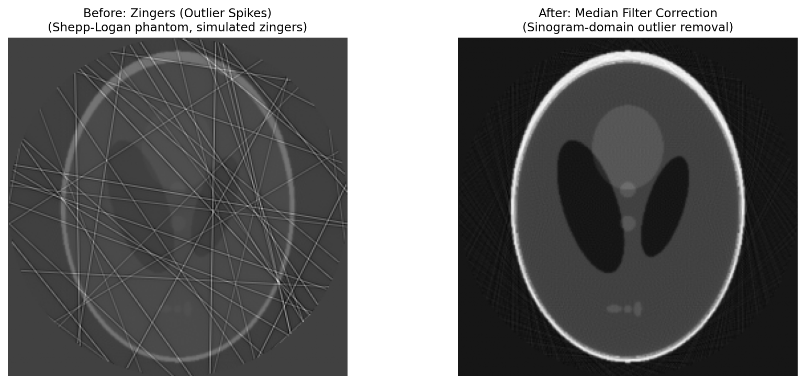

# 징거(Zinger / Gamma-ray Spike)

## 분류

| 속성 | 값 |
|------|-----|
| **모달리티** | 토모그래피 |
| **노이즈 유형** | 기기(Instrumental) |
| **심각도** | 주요(Major) |
| **빈도** | 간헐적(Occasional) |
| **탐지 난이도** | 쉬움(Easy) |

## 시각적 예시



*합성 Shepp-Logan 팬텀 데이터에서의 징거 보정 전후 비교.*

**왼쪽(보정 전):** 개별 프로젝션에서 무작위 위치에 극도로 밝은 점(징거)이 관찰됩니다.
**오른쪽(보정 후):** 중앙값 필터 기반 이상치 제거 후 징거가 제거된 깨끗한 프로젝션을 확인할 수 있습니다.

## 설명

징거(Zinger)는 우주선(cosmic ray) 또는 감마선이 검출기에 직접 충돌하여 개별 프로젝션에서 발생하는 극도로 밝은 고립된 점입니다. 일시적(transient)이고 무작위 위치에 나타나는 것이 특징입니다.

사이노그램에서 징거는 고립된 점(isolated dot)으로 나타나며, 수직 줄무늬(vertical stripe)와는 명확히 구분됩니다. 수직 줄무늬는 검출기의 불량 픽셀로 인한 링 아티팩트를 유발하지만, 징거는 단일 프레임의 단일 픽셀 또는 소수 픽셀에만 영향을 미칩니다.

징거의 강도는 일반적으로 주변 픽셀보다 수십~수백 배 높아 쉽게 식별할 수 있으며, 재구성 시 징거 위치에서 방사상으로 퍼지는 줄무늬형 아티팩트(streak artifact)를 유발합니다.

## 근본 원인

1. **우주선(Cosmic Ray):** 고에너지 입자가 검출기 센서에 직접 충돌하여 큰 신호를 생성
2. **감마선 스파이크(Gamma-ray Spike):** 방사광 시설 환경에서 산란된 고에너지 광자
3. **검출기 전자회로 노이즈:** 드물게 발생하는 전자회로의 일시적 오류
4. **방사성 붕괴:** 검출기 재료 내 미량 방사성 원소의 붕괴

## 빠른 진단

연속 프로젝션을 비교하여 일시적으로 나타나는 밝은 점을 탐지합니다:

```python
import numpy as np

def quick_zinger_check(projections, frame_idx=0):
    """연속 프로젝션 간 차이로 징거를 빠르게 확인합니다."""
    diff = np.abs(projections[frame_idx + 1].astype(float) - projections[frame_idx].astype(float))
    threshold = np.median(diff) + 10 * np.median(np.abs(diff - np.median(diff))) * 1.4826
    zingers = np.where(diff > threshold)
    print(f"Potential zingers in frame {frame_idx}: {len(zingers[0])} pixels")
    print(f"Max intensity difference: {np.max(diff):.1f}")
    return zingers
```

이 코드는 연속된 두 프로젝션 간의 픽셀별 차이를 계산하여, MAD 기반 임계값을 초과하는 픽셀을 잠재적 징거로 식별합니다. 징거는 일시적이므로 연속 프레임에서 같은 위치에 반복되지 않습니다.

## 탐지 방법

### 시각적 지표

- **프로젝션:** 단일 프레임에서 주변보다 극도로 밝은 고립된 점
- **사이노그램:** 수직 줄무늬가 아닌 고립된 밝은 점(dot)
- **연속 프레임 비교:** 동일 위치에 밝은 점이 반복되지 않음 (일시적 특성)
- **히스토그램:** 극단적인 고값 꼬리(tail)가 나타남

### 자동 탐지

```python
import numpy as np
from scipy import ndimage

def detect_zingers(projections, threshold=10.0):
    """
    프로젝션 스택에서 징거를 탐지합니다.

    Parameters
    ----------
    projections : np.ndarray
        3D 프로젝션 배열 (num_angles x height x width)
    threshold : float
        MAD 기반 이상치 탐지 임계값 (기본값: 10.0)

    Returns
    -------
    dict
        탐지 결과를 담은 딕셔너리
    """
    zinger_map = np.zeros_like(projections, dtype=bool)
    zinger_count = 0

    for i in range(projections.shape[0]):
        frame = projections[i].astype(float)

        # 국소 중앙값과의 차이 계산
        local_median = ndimage.median_filter(frame, size=3)
        residual = np.abs(frame - local_median)

        # MAD 기반 임계값
        mad = np.median(residual) * 1.4826
        if mad > 0:
            scores = residual / mad
            mask = scores > threshold
        else:
            mask = residual > 0

        zinger_map[i] = mask
        zinger_count += np.sum(mask)

    # 심각도 분류
    total_pixels = projections.size
    zinger_fraction = zinger_count / total_pixels

    if zinger_fraction > 0.001:
        severity = "major"
    elif zinger_fraction > 0.0001:
        severity = "minor"
    else:
        severity = "negligible"

    return {
        "zinger_map": zinger_map,
        "total_zingers": int(zinger_count),
        "zinger_fraction": float(zinger_fraction),
        "severity": severity,
        "affected_frames": int(np.sum(np.any(zinger_map, axis=(1, 2))))
    }
```

## 해결 및 완화

### 예방 (데이터 수집 전)

- 프레임당 노출 시간이 길수록 징거의 상대적 영향이 감소합니다
- 다중 노출 후 평균/중앙값을 사용하면 징거를 효과적으로 제거할 수 있습니다
- 검출기 차폐(shielding)를 통해 우주선의 영향을 줄일 수 있습니다

### 보정 — 전통적 방법

```python
import tomopy
import numpy as np
from scipy import ndimage

# 방법 1: TomoPy 이상치 제거
# 국소 중앙값 필터 기반 이상치 교체
cleaned = tomopy.remove_outlier(
    projections,
    dif=1000,     # 국소 중앙값과의 최대 허용 차이
    size=5        # 중앙값 필터 커널 크기
)

# 방법 2: 시간 중앙값 필터
# 연속 프로젝션 간 중앙값을 이용한 징거 제거
def temporal_median_filter(projections, window=3):
    """시간축 중앙값 필터로 징거를 제거합니다."""
    cleaned = projections.copy()
    half_w = window // 2

    for i in range(half_w, projections.shape[0] - half_w):
        local_stack = projections[i - half_w:i + half_w + 1]
        local_median = np.median(local_stack, axis=0)

        # 중앙값과 크게 다른 픽셀만 교체
        diff = np.abs(projections[i].astype(float) - local_median)
        mad = np.median(diff) * 1.4826
        if mad > 0:
            mask = diff > 10 * mad
            cleaned[i][mask] = local_median[mask]

    return cleaned
```

### 보정 — AI/ML 방법

징거 제거는 전통적인 중앙값 기반 방법으로 이미 매우 효과적이므로, 별도의 AI/ML 접근 방식이 필요하지 않습니다. 중앙값 필터와 이상치 탐지 기반 방법이 징거의 일시적이고 고립된 특성에 최적으로 대응합니다.

## 미보정 시 영향

- **줄무늬형 아티팩트(Streak Artifact):** 재구성 시 징거 위치에서 방사상으로 퍼지는 밝은 줄무늬가 발생
- **국소 밀도 왜곡:** 징거 위치의 재구성 값이 극도로 높아져 밀도 분석이 무효화됨
- **세분화(Segmentation) 오류:** 밝은 점이 고밀도 물질로 잘못 분류될 수 있음
- **정량적 분석 왜곡:** 통계 계산(평균, 표준편차 등)이 이상치에 의해 심하게 편향됨

## 관련 자료

- [TomoPy를 활용한 탐색적 데이터 분석(EDA)](../../03_eda/tomo_eda.md)
- [TomoPy 역공학 분석](../../07_reverse_engineering/tomopy_recon.md)
- [링 아티팩트](ring_artifact.md)
- [줄무늬 아티팩트](streak_artifact.md)

## 핵심 요약

> **징거는 중앙값 기반 이상치 교체로 쉽게 탐지하고 제거할 수 있습니다.** 재구성 전에 프로젝션 단계에서 징거를 탐지하여 제거하는 것이 중요하며, TomoPy의 `remove_outlier()` 또는 시간축 중앙값 필터가 효과적인 해결책입니다.
