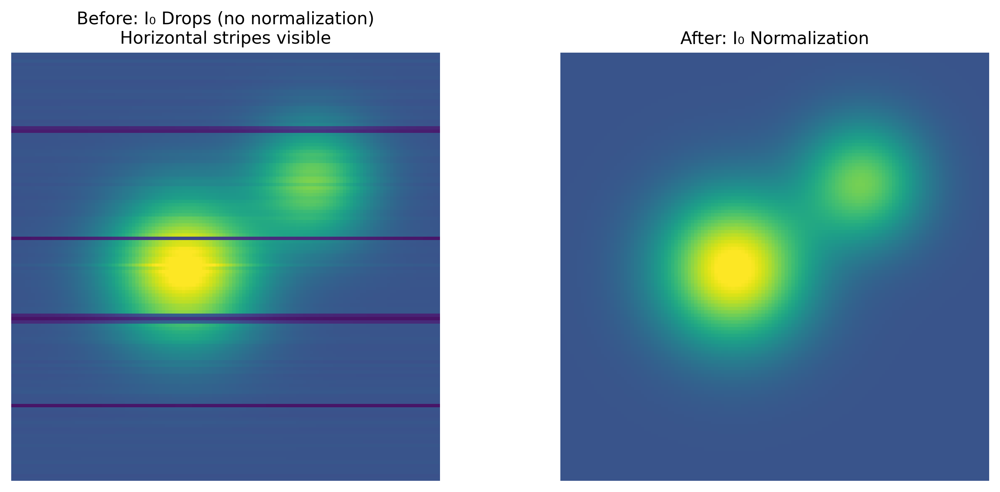

# I0 정규화 문제(I0 Normalization Issues)

## 분류

| 속성 | 값 |
|------|-----|
| **모달리티** | XRF 현미경 |
| **노이즈 유형** | 체계적(Systematic) |
| **심각도** | 주요(Major) |
| **빈도** | 흔함(Common) |
| **탐지 난이도** | 쉬움(Easy) |

## 시각적 예시



> **이미지 출처:** 합성 — I0 빔 전류 저하로 수평 줄무늬가 발생한 시뮬레이션 XRF 맵, I0 정규화로 보정.

## 설명

I0 정규화 문제는 래스터 스캔 중 입사 X선 빔 강도가 변하지만 이 변동이 원소 맵에서 보정되지 않을 때 발생합니다. 각 픽셀의 형광 신호는 원소 농도와 입사 플럭스 모두에 비례하므로, I0의 공간적 또는 시간적 변동이 체계적인 강도 기울기 또는 패턴으로 원소 맵에 직접 각인됩니다. 이것은 XRF 현미경에서 가장 흔하고 쉽게 보정 가능한 아티팩트 중 하나이지만, 자주 간과되어 순전히 기기적 원인의 겉보기 조성 경향을 만듭니다.

## 근본 원인

싱크로트론 광원에서 입사 빔 강도는 여러 이유로 변합니다: 탑업 주입 사이의 저장 링 전류 감소(보통 1-2% 변동), 분 단위에서 시간 단위의 모노크로메이터 열적 드리프트에 의한 플럭스 변화, 집속 광학계에 대한 빔 위치 불안정성 등. 시료 상류에 배치된 I0 이온 챔버 또는 다이오드가 이러한 변동을 기록합니다. 원시 형광 카운트를 각 픽셀의 해당 I0 값으로 나누지 않으면, 결과 원소 맵에는 I0 변동 패턴에 비례하는 곱셈적 아티팩트가 포함됩니다.

## 빠른 진단

```python
import numpy as np

# i0_map: 2D I0 값 맵 (원소 맵과 동일한 형태)
i0_variation = (np.max(i0_map) - np.min(i0_map)) / np.mean(i0_map)
row_means = np.mean(i0_map, axis=1)
row_trend = (row_means[-1] - row_means[0]) / np.mean(row_means)
print(f"I0 전체 변동: {i0_variation:.1%}")
print(f"I0 행 추세 (처음→마지막): {row_trend:+.1%}")
print(f"정규화 필요: {'예' if i0_variation > 0.02 else '아마도 아님'}")
```

## 탐지 방법

### 시각적 지표

- 시료 특징에 해당하지 않는 원소 맵의 부드러운 기울기
- 기울기 방향이 스캔 방향(행별 또는 열별)과 상관
- 모든 원소 맵이 동일한 기울기 패턴을 보임(모두 I0에 따라 변화하므로)
- 행 또는 열 평균 그래프가 I0 시계열과 일치하는 체계적 추세를 드러냄

### 자동 탐지

```python
import numpy as np
from scipy import stats


def detect_i0_normalization_issue(element_map, i0_map,
                                   correlation_threshold=0.5):
    """원소 맵에 I0 상관 아티팩트가 포함되어 있는지 탐지합니다."""
    elem_row_avg = np.mean(element_map.astype(float), axis=1)
    i0_row_avg = np.mean(i0_map.astype(float), axis=1)
    corr_row, p_row = stats.pearsonr(elem_row_avg, i0_row_avg)

    elem_col_avg = np.mean(element_map.astype(float), axis=0)
    i0_col_avg = np.mean(i0_map.astype(float), axis=0)
    corr_col, p_col = stats.pearsonr(elem_col_avg, i0_col_avg)

    i0_flat = i0_map.astype(float)
    i0_cv = np.std(i0_flat) / np.mean(i0_flat)
    i0_range = (np.max(i0_flat) - np.min(i0_flat)) / np.mean(i0_flat)

    needs_normalization = (
        (abs(corr_row) > correlation_threshold) or
        (abs(corr_col) > correlation_threshold)
    ) and i0_range > 0.02

    return {
        'row_correlation': float(corr_row),
        'col_correlation': float(corr_col),
        'i0_cv': float(i0_cv),
        'i0_range_fraction': float(i0_range),
        'needs_normalization': needs_normalization,
    }
```

## 해결 방법 및 완화

### 보정 — 전통적 방법

```python
import numpy as np


def normalize_by_i0(element_map, i0_map, i0_reference=None):
    """입사 빔 강도(I0)로 XRF 원소 맵을 정규화합니다."""
    if i0_reference is None:
        i0_reference = np.mean(i0_map[i0_map > 0])

    i0_safe = i0_map.astype(float).copy()
    i0_safe[i0_safe <= 0] = np.nan

    normalized = element_map.astype(float) / i0_safe * i0_reference
    normalized = np.nan_to_num(normalized, nan=0.0)
    return normalized
```

### 보정 — AI/ML 방법

I0 정규화는 단순한 나눗셈이므로 일반적으로 ML 접근법이 필요하지 않습니다. 그러나 I0 모니터 자체에 노이즈가 있거나 드롭아웃이 있는 경우, I0 시간 발전에 대한 학습된 부드러운 모델(예: I0 시계열에 대한 가우시안 프로세스 회귀)이 원시 I0 값보다 더 안정적인 정규화 신호를 제공할 수 있습니다.

## 보정하지 않을 경우의 영향

I0 정규화 없이 모든 원소 맵에는 빔 강도 패턴을 반영하는 곱셈적 아티팩트가 포함됩니다. 이는 시료 전체에 거짓 조성 기울기를 만들고, 정량적 농도 추정을 왜곡하며, 원소 간 공간 관계에 대한 잘못된 결론으로 이어질 수 있습니다.

## 관련 자료

- [XRF EDA 노트북](../../06_data_structures/eda/xrf_eda.md) — I0 품질 검사 및 정규화 워크플로
- 관련 아티팩트: [데드타임 포화](dead_time_saturation.md) — 데드타임 보정이 I0 정규화에 선행해야 함
- 관련 아티팩트: [스캔 줄무늬](scan_stripe.md) — 스캔 라인 내 I0 변동이 줄무늬를 유발

## 핵심 요점

I0 정규화는 XRF 데이터 처리에서 가장 중요한 단일 보정 단계입니다. 정량적 분석 전에 항상 모든 원소 맵을 해당 I0 맵으로 나누세요. 먼저 I0 품질을 확인하세요 — 모니터 드롭아웃과 스파이크가 모든 정규화된 맵에 아티팩트로 전파됩니다.
