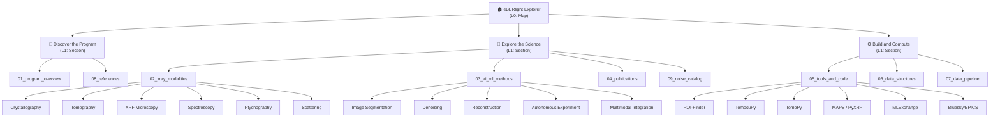

# Information Architecture

## Overview

The 8 note folders (plus 09\_noise\_catalog) map to **3 task-oriented clusters** aligned with the three primary user intents identified in persona research. This reduces the cognitive load from 9 top-level choices to 3, following Miller's 7±2 heuristic for working memory.

## Folder-to-Cluster Mapping

| Cluster | Folder | Content |
|---------|--------|---------|
| **Discover the Program** | `01_program_overview` | BER mission, APS facility, beamlines, partners, research domains |
| **Discover the Program** | `08_references` | Glossary, bibliography, useful links |
| **Explore the Science** | `02_xray_modalities` | 6 modalities: crystallography, tomography, XRF, spectroscopy, ptychography, scattering |
| **Explore the Science** | `03_ai_ml_methods` | 14 AI/ML methods across 5 categories |
| **Explore the Science** | `04_publications` | 14 publication reviews |
| **Explore the Science** | `09_noise_catalog` | 29+ noise/artifact types, troubleshooter |
| **Build and Compute** | `05_tools_and_code` | 7 tools with reverse engineering, pros/cons |
| **Build and Compute** | `06_data_structures` | HDF5 schemas, EDA guides, data scale analysis |
| **Build and Compute** | `07_data_pipeline` | Acquisition → streaming → processing → analysis → storage |

### Mapping Rationale

- **Discover the Program** answers "What is this?" — program context, facilities, references. Aligned with Persona B (New BER User).
- **Explore the Science** answers "What can I learn?" — modalities, methods, publications, noise handling. Aligned with Persona A (Beamline Scientist).
- **Build and Compute** answers "How do I do it?" — tools, code, data, pipeline. Aligned with Persona C (Computational Scientist).

Every folder maps to exactly one cluster. The mapping is exhaustive (all folders assigned) and disjoint (no folder in two clusters).

## 4-Zoom Navigation Model

Users navigate through four levels of increasing specificity:

| Level | Name | Example | UI Element |
|-------|------|---------|------------|
| **L0** | Map | Landing page — 3 cluster cards | Hero + cluster cards |
| **L1** | Section | "Explore the Science" cluster landing | Cluster page with note cards |
| **L2** | Topic | "AI/ML Methods → Denoising" sub-section | Note list filtered by category |
| **L3** | Source | "TomoGAN" individual note | Full note detail view |

### Zoom Transitions

- **L0 → L1**: Click a cluster card on the landing page.
- **L1 → L2**: Click a category header or tag filter on the cluster page.
- **L2 → L3**: Click a note card to open the full detail view.
- **Any level → L0**: Click the site title or "Home" in the breadcrumb.

### Concrete Examples

**Beamline Scientist looking for XRF denoising:**
1. L0 (Map): Sees 3 cluster cards → clicks "Explore the Science"
2. L1 (Section): Sees notes from `02_xray_modalities`, `03_ai_ml_methods`, `04_publications`, `09_noise_catalog` → clicks "XRF Microscopy" modality tag
3. L2 (Topic): Sees XRF-related notes filtered → clicks "Deep Residual XRF Enhancement"
4. L3 (Source): Reads the full method note with metadata panel

**New BER User exploring the program:**
1. L0 (Map): Sees 3 cluster cards → clicks "Discover the Program"
2. L1 (Section): Sees program overview, beamlines, references → clicks "Research Domains"
3. L3 (Source): Reads research domains note, follows link to relevant beamline

## Navigation Rules

1. **Top navigation** is always visible: Home | Discover | Explore | Build.
2. **Breadcrumb** reflects the current path: Home > Cluster > [Category] > Note.
3. **Zoom indicator** shows the current level (L0–L3) as a visual stepper.
4. **Back navigation** via breadcrumb — each segment is clickable.
5. **Cross-cluster links** are allowed in metadata panels (e.g., a method note can link to a tool note in a different cluster).

## IA Tree (Mermaid)

